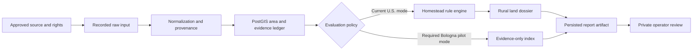
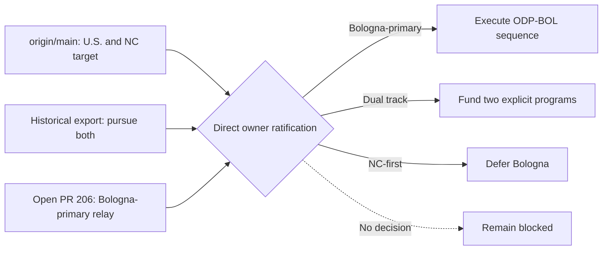
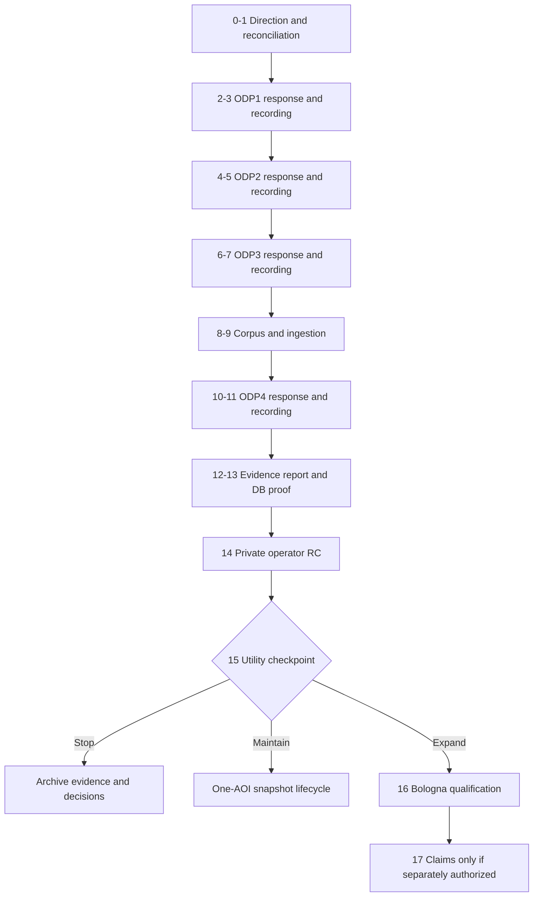

# Land Diligence Program Roadmap and Progress Ledger

Status: `program-roadmap-candidate`

Last reconciled: `2026-07-22`

Repository baseline: `origin/main@26d8b1342a2d0b1cf8435b6fad7b1542d3f097ae`

Active execution plan: `plans/2026-07-02-authority-evidence-intake.md`

This document is the durable program-level synthesis for what has been built, what
has been proven, what remains blocked, and how the project should advance. It is not
an authority record. It does not approve Bologna, a source, a corpus, a rulepack, a
runtime, a qualification transition, or a product release.

## Goal

Maintain one coherent, evidence-backed account from the repository foundation to the
intended product outcome, then define the smallest safe sequence that can turn the
existing scaffold into a useful private operator workflow without overstating evidence,
qualification, legal certainty, source rights, freshness, or owner intent.

The candidate target, if directly ratified by the owner, is a private/operator-only
Bologna pilot for one bounded parcel or site AOI. Its first report mode is evidence-only:
stored source observations, source failures, provenance, caveats, and as-of dates, with
no interpreted suitability result and no reuse of U.S. homestead claims.

## Non-goals

- This document does not replace `state/PROJECT_STATE.md`, the qualification catalog,
  source-rights records, accepted ADRs, or the active execution plan.
- It does not treat a Codex/Claude session, export, open PR, green CI run, or routine
  owner merge by itself as sufficient owner authority.
- It does not authorize live vendors, paid APIs, hosted production, Level 10, external
  users, a broad UI redesign, a generalized multi-jurisdiction framework, or a new
  Italy rulepack.
- It does not require universal TDD, duplicate validators, speculative abstractions, or
  tests for behavior that remains intentionally blocked.
- It does not assert legal access, buildability, title, water rights, wetland
  jurisdiction, surveyed boundaries, value, financing suitability, or investment advice.

## 1. Truth and authority model

| Question | Canonical evidence | What is not sufficient |
|---|---|---|
| What has landed? | Fetched `origin/main`, commit history, and files at that ref | Dirty root files, an open PR, or a session report |
| What is active? | `state/PROJECT_STATE.md`, `tasks/task_queue.yaml`, and the active plan, reconciled to live refs | An older checkpoint SHA or a superseded roadmap section |
| What did an agent do? | Task transcript plus matching branch/ref/files | Narrative claims without repository corroboration |
| What did the owner authorize? | A directly owner-authored/signed payload, or explicit authenticated owner ratification of exact enumerated decisions, with a stable locator and human provenance review | Agent inference, relay alone, a prefilled template, or routine merge without explicit ratification meaning |
| What source use is allowed? | Per-dataset source-rights record and cited terms | Catalog discovery, general portal terms, or technical accessibility |
| What runtime behavior is proven? | Relevant unit/contract checks plus isolated integration proof for persistence claims | Static artifact tests or default verify when DB smoke was skipped |
| What is empirically qualified? | `state/EMPIRICAL_QUALIFICATION_STATUS.yaml` under the frozen qualification contract | A freeze, fixture regression, green CI, pilot success, or informal calibration |

An owner-signed ADR may live inside this repository and still qualify as external to the
agent-inference chain. Explicit owner approval/merge may also ratify exact decisions when
the PR presents them as a ratification request and the authenticated owner action has that
recorded meaning. A routine merge does not fill blank decisions or authenticate agent
inference. An agent may scaffold structure but may not fill owner decisions. A human must
verify provenance because the evaluator validates shape and blocked-state invariants, not
authenticity.

### Current floor at reconciliation

| Surface | 2026-07-22 state |
|---|---|
| Live main | Local and fetched `origin/main` both `26d8b1342a2d0b1cf8435b6fad7b1542d3f097ae` |
| Active work | `AUTH-EVIDENCE-INTAKE`; task queue last reports 154 done, 10 blocked, 1 active |
| Qualification | `P0 = NOT_RUN`; default no-runtime status derivation `BLOCKED=0 NOT_RUN=21` |
| Bologna authority | ODP1 review-only pursuit answered; ODP2/3/4 missing owner answer; pilot/source records zero |
| Source authority | DS-002 is the sole approved source for the frozen NC/flood target; Bologna sources remain candidates |
| Proposal context | PR #206 and #207 carry the candidate roadmap/owner-context and scope-form work; `gh pr view` reported both open, non-draft, `CLEAN`, and unmerged on 2026-07-22, but refresh this transient status before action |
| Root checkout | Modified coordination inboxes plus untracked ADR/form/roadmap copies; treat as preservation state, not authority |
| Recent Git activity | No commit found on inspected refs in the preceding 24-hour window |

## 2. Intended product state

The intended end state is not merely a generated document. It is a reproducible,
inspectable diligence compilation workflow in which:

1. An operator selects one explicitly bounded AOI and an allowed intent.
2. Only approved source fields are captured, with native source identifiers, source
   version/effective date, retrieval metadata, rights, caveats, and failure status.
3. Raw or recorded source material remains hash-bound; normalized geometry is stored in
   PostGIS with transformation provenance.
4. Every displayed factual observation traces to stored evidence. Missing, stale,
   conflicting, outside-coverage, and failed-source states remain visible.
5. Evidence-only reports make no suitability or legal conclusion. Any future interpreted
   claim requires a separately authorized jurisdiction/rulepack contract.
6. The report artifact can be reproduced from the same approved inputs and its persisted
   hash can be verified against the database metadata.
7. The private operator can inspect lineage, review caveats, and distinguish evidence,
   interpretation, confidence, and unresolved questions.
8. Qualification claims are made only from a separately frozen and executed Bologna
   qualification target, never inherited from the NC/flood proof-of-method.

## 3. Accomplishment ledger

`LANDED` means present on `origin/main`. `OPEN-PR` means reviewable but not canonical.
`BLOCKED` and `NOT_RUN` are honest states, not failures to be cosmetically removed.

| Milestone | State | Contribution toward the intended product | Explicit non-claim |
|---|---|---|---|
| Repository health and Windows verification | LANDED | Established unit, structural, qualification, and optional DB gates; CI installs and runs the lint/type toolchain | Local verify proves lint/type only when ruff and mypy are installed and actually run; default verify does not prove DB smoke ran |
| PostgreSQL/PostGIS schema spine | LANDED | Supplies system-of-record tables for sources, areas, evidence, claims, report metadata, and auditability | Presence of tables does not prove a production migration or Bologna data |
| Source registry and rights contracts | LANDED | Separates source identity, provenance, licensing, field use, retention, export, and failure policy | Candidate discovery does not approve a source |
| Area and geometry contracts | LANDED | Provides canonical AOI geometry validation and PostGIS storage in EPSG:4326 | Bologna source CRS and transformation precision are not yet resolved |
| Evidence ledger and source-failure handling | LANDED | Makes evidence lineage and failed retrievals first-class rather than silent no-issue results | Evidence existence does not authorize interpretation |
| Claim/rule and report-run contracts | LANDED for U.S./NC | Proves evidence-linked claims, deterministic report metadata, cautious language, and report artifacts | Current rules and dossier semantics are not geography-neutral |
| API, review, audit, and operator surfaces | LANDED | Provides intake, report generation, approval, lineage, comparison, download, and local operator workflows | A fixture-backed operator workflow is not live diligence or empirical utility proof |
| Selected NC county fixture closure | LANDED | Exercises Buncombe, Chatham, and Brunswick AOIs across expected and failure conditions | Fixtures are snapshots and cannot satisfy a fresh qualification cohort |
| Bounded U.S. live-connector paths | LANDED, default-off/review-gated | Demonstrates supervised retrieval, provenance, durable scheduling, review approval, and report resumption for selected public U.S. sources | Technical paths and restricted source approval do not make them Bologna sources, broadly production-ready, or automatically current |
| Extended-domain fixture ingestion | LANDED | Adds minerals, broadband, environmental, water, and geology evidence paths and demonstrates reusable connector-to-evidence mechanics | These U.S. sources and domain labels do not transfer automatically to Bologna |
| DB-backed report proof pattern | LANDED | Demonstrates fixture ingestion through persisted evidence/claim links to a DB-loaded report artifact | Existing proof uses U.S. claim/dossier semantics and is not ODP-BOL-004 |
| Readiness, retention, security, packaging, and deployment controls | LANDED as control plane | Makes release constraints inspectable and fail-closed | Many controls are blocked/not-run; their existence is not release readiness |
| Empirical qualification control plane and QFREEZE-2 | LANDED; execution NOT_RUN | Freezes a reproducible NC/flood/DS-002 target and prevents informal PASS claims | All 21 qualification cases remain NOT_RUN; Bologna inherits none of this validity |
| Bologna ODP/ODGAV gate family | LANDED as validate-only control plane | Defines owner-answer, source-rights, corpus, and DB-proof prerequisites in dependency order | Pilot/source records remain empty and no downstream implementation is authorized |
| Forward-roadmap and scope-form corrections | OPEN-PR #206/#207 | Produce reviewable decision and intake artifacts with corrected blocker language | Neither PR is canonical authority; both remain open and unmerged |

The project has therefore completed most reusable lower-layer mechanics, but it has not
completed the external facts that make a new geography legitimate: exact owner scope,
approved datasets and fields, recorded corpus, Bologna report semantics, runtime proof,
operator utility, or empirical qualification.

## 4. Recent progress and investigations

| Window | Work completed | Why it matters |
|---|---|---|
| Codex task `019f2153-e28a-7720-85ef-f5899b998add` | Reconciled live main and found authority/wording mismatches in the owner-facing Bologna toolkit | Prevented review-only or future-tense text from being treated as a real unblock |
| Codex task `019f2158-87c5-7e12-adf1-0e39677535f6` | Corrected PR #206/#207 candidate documents, reran qualification and repository checks, and left both PRs unmerged | Improved candidate accuracy while preserving authority and qualification boundaries |
| Claude export `session-455cf568-9a4f-46f1-9f6b-00c596e48880.md` | Preserved the historical "pursue both" signal, later Bologna-primary relay, and U.S. fixture work context | Exposed strategic history but cannot establish landing or direct owner authority alone |
| 2026-07-21/22 adversarial re-audit | Found report-mode incompatibility, ODP4 zero-claim conflict, authority-rule ambiguity, verification overclaim risk, and process bloat | Corrected the future sequence before Bologna data could enter U.S.-specific semantics |
| Most recent 24-hour Git window | No commits found on inspected refs | Current progress is planning/audit progress, not landed implementation |

## 5. Architecture: reusable core and unsafe coupling



### Reusable boundaries

- Source identity, source-rights metadata, retrieval provenance, evidence contracts,
  source-failure events, area versioning, PostGIS storage, audit events, report metadata,
  object-store artifacts, review status, and operator authentication are reusable.
- The fixture workflow already supplies the right implementation pattern: capture first,
  validate and review, normalize with provenance, then admit evidence.
- The qualification catalog and readiness gates correctly separate proof states from
  aspiration, provided their results are not collapsed into one generic green signal.

### Fragile or non-modular boundaries

| Area | Current weakness | Likely consequence | Narrow correction |
|---|---|---|---|
| Report orchestration | `ReportRunService` combines evidence approval, synthetic failures, U.S. rules, claim creation, manifest building, and persistence | Bologna can inherit U.S. soil, septic, county, zoning, or homestead semantics | Add an explicit evaluation mode and bypass all U.S. synthesis in evidence-only mode |
| Dossier rendering | The rural dossier is a large U.S.-specific renderer and can derive `screening_clear` from an empty claim set | A zero-claim Bologna report could falsely communicate clearance | Prohibit rural-dossier rendering for evidence-only reports and add a separate evidence index |
| Rule engine | The ruleset label is configurable but implementation conditions are hardcoded around the homestead MVP | A nominal new ruleset can appear modular while executing U.S. behavior | Do not add a Bologna ruleset until real claim requirements exist; refactor only from concrete duplication |
| Report schema | Zero claims are allowed, but `source_manifest` still requires ruleset identifiers | Implementers may fabricate a ruleset or claim to satisfy shape | Define a documented `evidence_only_no_claims` policy and additive `evaluation_mode`; use v2 only if compatibility fails |
| ODP-BOL-004 gate | Current language expects claim-evidence links | Evidence-only execution could be forced to create fake claims | Require an explicitly empty claim-link set and human-reviewed zero-claim proof |
| Authority evaluation | Automated checks validate shape, citations, coverage, and no-unlock fields, not human authenticity | Well-formed agent-authored text can be mistaken for owner authority | Preserve signed input, hash it, map it side by side, and require human provenance attestation |
| Geometry | Canonical storage expects EPSG:4326 while Bologna/RER native CRS is unresolved | Silent reprojection or axis-order errors can corrupt spatial evidence | Record native CRS, transform version, axis order, precision, and raw hash before normalization |
| Operator fixtures | Current cases and report language are NC/U.S.-specific | Reusing operator cases can create misleading labels and acceptance signals | Add only one Bologna-specific operator case after the corpus and report mode exist |
| Governance surface | More than 100 Bologna-related scripts/configs/tests/plans/runbooks exist before any approved source or fixture | More control-plane work produces churn without product learning | Freeze new gate families; consume existing gates in one vertical slice |
| Workspace state | Dirty root copies, many worktrees, and stale state SHA text coexist with open PRs | Pull collisions and inaccurate progress claims become likely | Use clean owned worktrees, preserve conflicting files, and reconcile state once per landed milestone |

## 6. Competing positions and consensus

### Geography and product direction

- Position A: continue NC because it is already implemented and qualification-frozen.
- Position B: make Bologna primary because the July 6 relay says it is the live product line.
- Position C: run both in parallel to preserve optionality.
- Consensus: this is an owner-value decision, not an engineering inference. If the July 6
  direction is directly ratified, Bologna-primary is the best fit because it avoids
  splitting scarce source, legal, operator, and qualification work. NC remains a frozen
  proof-of-method, not discarded code. Without ratification, implementation holds.

### Cross-geography architecture

- Position A: generalize the whole stack now with `LocalityProfile`, pluggable rulepacks,
  runtime profiles, and an authority classifier.
- Position B: duplicate the U.S. path for Bologna to move faster.
- Consensus: both are premature. Add only the one real policy boundary required now:
  evidence-only versus interpreted-claims evaluation. Extract a broader locality/profile
  abstraction only after a second implemented geography reveals repeated variation.

### Testing and governance

- Position A: require TDD and a checker for every new decision field.
- Position B: rely on manual review because this is a private pilot.
- Consensus: test according to consequence. Pure behavior receives focused regression
  tests, persisted claims receive real DB proof, legal/authority judgments receive human
  review, and unchanged blocked states receive no new tests. This avoids both under-proof
  and control-plane churn.

## 7. Strategic choices

| Choice | Best fit when | Benefits | Costs and consequences |
|---|---|---|---|
| A. Bologna-primary | The owner directly ratifies the July 6 direction | Focuses source review, report semantics, operator learning, and eventual qualification on the intended geography | Requires a new corpus, evidence-only report path, Bologna-specific qualification, and careful rights/CRS/language handling |
| B. Explicit dual track | The owner needs both products and funds two maintained cohorts | Preserves NC utility while Bologna develops | Duplicates source governance, product decisions, regression matrices, freshness work, and qualification; highest context-switch cost |
| C. NC-first, Bologna deferred | The owner does not ratify Bologna or values fastest use of the existing stack | Lowest immediate engineering change; reuses selected counties and DS-002 | Contradicts the pending direction and leaves Bologna gate investment unused |
| D. Hold | No direct authority arrives | Preserves integrity and prevents speculative implementation | Produces no product learning; only maintenance and decision intake remain justified |

Recommendation: choose A only after direct ratification. Until then, D is the only
authority-safe operational state. Do not infer B or C from sunk cost, silence, or open PRs.



## 8. Proposed Bologna pilot design

### Scope boundary

- One parcel or site AOI represented as a valid Polygon/MultiPolygon, plus optional
  context-buffer/locality metadata. A whole-municipality pilot is a different product
  scope and must not be selected implicitly.
- Private local operator only. Hosted production, public intake, billing, and external
  user identity are outside the current candidate target but their existing blockers
  remain intact.
- One or two source datasets are enough for the first vertical slice. Selecting every
  discovered Bologna source before utility is demonstrated is not justified.

### Data and evidence boundary

- Per-dataset rights review controls allowed fields, raw retention, caching, export,
  AI use, attribution, and redistribution. Portal-level terms are discovery context,
  not a substitute for dataset terms.
- Personal owner, address, contact, and identifier fields are default-denied. If a
  selected field contains personal data, trigger explicit privacy/legal review and
  document purpose, minimization, retention, and access.
- Preserve the Italian source text as authoritative. Any English translation is a
  derived convenience artifact with translator/method/version provenance.
- Every fixture records source/effective/retrieval dates and displays an `as of` date.
  A recorded fixture is reproducible, not current, unless a recapture policy says so.
- Canonical geometry is EPSG:4326, but native CRS, transform implementation/version,
  axis-order handling, precision caveats, and raw geometry hash remain attached.

### Evaluation and report boundary

- Treat the new report mode as a report-semantics/API change: write or update the
  execution plan and ADR before implementation, and preserve the current default mode.
- Add `evaluation_mode = evidence_only` and a versioned evaluation policy identifier.
  For v1 compatibility, use a documented reserved ruleset identifier such as
  `evidence_only_no_claims`; if consumers cannot safely distinguish it, create an ADR
  and version the contract rather than weakening existing semantics.
- Evidence-only mode produces exactly zero interpreted claims, red flags, advisories,
  suitability labels, and synthetic U.S. unknown claims.
- It may display factual source coverage/failure status, evidence values, caveats,
  provenance, and explicit questions for professional review.
- A fail-closed guard rejects rural-dossier rendering for evidence-only reports.
- The human artifact is an evidence index, not a rural-land dossier with blank sections.

### Persistence boundary

- Persist source, dataset/version, ingestion run, area version, evidence rows, report
  metadata, and the object-store artifact. `claim_evidence` count must be exactly zero.
- Verify artifact serialization, content hash, reload, and source/evidence lineage in one
  isolated Postgres/PostGIS run.
- Decide and test the orphan-artifact policy for the current object-store-first then DB
  insert sequence. A failed DB transaction must be detectable and recoverable.

## 9. Bottom-up execution sequence

| Step | Work and output | Acceptance / PASS | Stop or FAIL consequence |
|---|---|---|---|
| 0. Direction closure | Direct owner choice among A/B/C plus the authority-record rule | Owner-authored/signed payload or explicit authenticated ratification, stable locator, human provenance review, no downstream unlock bundled | No product implementation; remain in authority intake |
| 1. PR/root reconciliation | Revise/merge/close #206/#207; preserve or archive conflicting root copies; use a clean owned worktree | Branch diff matches intended files, no untracked overwrite risk, canonical main refreshed | Do not pull over conflicting files or treat open PR text as landed |
| 2. ODP-BOL-001 response | Exact AOI, operator/use case, evidence-only mode, questions, non-goals, language, privacy, CRS, source limit, and stop conditions | All 12 decisions answered with cited owner evidence; evaluator and human externality review pass; unlock list remains empty | Missing/ambiguous answer keeps every downstream stage blocked |
| 3. ODP1 authority recording | Hash/preserve the signed response and transcribe it side by side into existing pilot-scope authority records | Exact mapping, reviewer attestation, recording validators, and narrow recording PR pass | Any inferred value, transcription drift, or bundled downstream change blocks merge |
| 4. ODP-BOL-002/BSA response | Owner selects only source candidates for review and answers the exact per-source rights/field/retention/CRS/failure questions | Response gates pass and cited terms cover every selected dataset; no source is yet approved | Unknown/incompatible rights or personal-data ambiguity stops that source |
| 5. ODP2 authority recording | Record approved source identity, allowed fields/use, rights, versions, reviewers, and explicit remaining blocks | Recorded authority/rights validators and human cited-terms review pass before any corpus or connector change | A response alone cannot mutate rights rows, approve a source, or unlock capture |
| 6. ODP-BOL-003 response | Owner authorizes the exact AOI/source/version corpus boundary, capture method, raw retention, and success/failure cases | Corpus response gate passes with no capture or generated artifact side effect | Missing corpus authority keeps fixture capture and ingestion blocked |
| 7. ODP3 authority recording | Preserve/hash the response and record the bounded corpus authority in the existing config surface | Recording PR is limited to authorized records/pins and all corpus authority checks pass | Do not capture fixtures merely because an owner response exists |
| 8. Corpus capture | Capture immutable success and no-data/failure fixtures plus manifest for the recorded boundary | Hashes, raw/native metadata, AOI match, dates, license, caveats, transform provenance, and failure semantics validate | Empty/generated runtime, unreviewed source, scope drift, or missing provenance fails closed |
| 9. Minimal ingestion | Add only selected fixture adapters and evidence normalization | Success and failure fixtures become evidence/source-failure rows with preserved provenance; no live calls | No generic framework, live connector, UI, or claims expansion |
| 10. ODP-BOL-004 response | Owner confirms evidence-only report-proof semantics, required DB/artifact evidence, reviewer, and exactly empty claim-link policy | ODP4 response gate and human semantic review pass; implementation remains blocked | The current non-empty claim-link wording or an ambiguous report contract blocks recording |
| 11. ODP4 authority recording | Record the accepted report-proof boundary and amend the gate/checker/runbook fixtures to encode `claim_evidence_links: []` under the named policy | Recorded authority and updated gate agree mechanically on zero claims before report/DB/API work | A response or proposed gate edit alone cannot authorize report implementation |
| 12. Evidence-only reporting | Approve the report-semantics plan/ADR, then add explicit mode, zero-claim policy, evidence index, and rural-renderer guard while preserving the current default | Schema/serialization and backward-compatibility pass; claims=0; no suitability/U.S. sentinel; as-of and caveats visible; overclaim test passes | Any interpreted clearance, default-mode regression, or U.S. geography leakage blocks progression |
| 13. ODP4 execution | Execute one isolated DB plus object-store round trip under the recorded boundary | Correct rows, area/evidence lineage, artifact hash/reload, claim links=0, and failure state are proven | Mocks-only proof, skipped DB smoke, shared state, or a fabricated claim link is insufficient |
| 14. Private operator RC | Run one normal and one degraded local workflow with human review | Operator can trace every value, distinguish failure/unknown, reproduce artifact, and sees no false clearance | Fix only demonstrated workflow defects; do not broaden scope |
| 15. Utility checkpoint | Owner reviews the pilot against explicit questions and operational cost | Choose stop/archive, maintain one-AOI snapshot, or authorize expansion with reasons | A demo does not silently become a product or qualification cohort |
| 16. Expansion and qualification | If authorized, define representative Bologna AOIs, frozen target/profile, protocol, reviewers, vault, reproducer, and P0/Q1/Q2 sequence | Separate Bologna qualification evidence satisfies the canonical catalog; status changes only under explicit authority | NC proof, one AOI, Q3 probes, or internal calibration cannot substitute |
| 17. Claims and lifecycle | Only if needed, authorize an Italy rulepack and professional review; add recapture, expiry, backup/restore, retention/purge, security review, and workspace cleanup | Claims remain evidence-linked and jurisdiction-reviewed; snapshots age visibly; recovery and invalidation are proven | Keep evidence-only indefinitely if claim authority or utility is absent |



## 10. Acceptance evidence and non-claims

| Gate | PASS proves | PASS does not prove |
|---|---|---|
| Owner-answer evaluator | Required structure, decision coverage, cited fields, and no requested unlocks | Owner authenticity, adequacy of evidence, or source permission |
| Human authority review | Signed provenance and faithful transcription | Technical feasibility or product utility |
| Source-rights review | The selected fields/use fit cited terms at review time | Legal advice, future terms, factual accuracy, or source availability |
| Corpus validation | Fixtures are immutable, attributable, structurally valid, and cover success/failure | Current data, representative geography, or correct interpretation |
| Unit/contract checks | Changed pure behavior and invariants work for covered cases | Persistence, deployment, or real source behavior |
| DB/object-store proof | One isolated persisted path and artifact round trip works | General scale, utility, freshness, or empirical qualification |
| Operator RC | The bounded workflow is usable and fails visibly for tested scenarios | Market demand, multi-user safety, jurisdictional validity, or broad coverage |
| Qualification PASS | The exact frozen target passed its sealed protocol | Unqualified domains, later data, other geographies, or legal conclusions |

## 11. Risk-proportionate verification policy

There is no universal TDD requirement. Tests are selected by the consequence of a
regression and by what the acceptance claim actually depends on.

- Authority-only documentation: run existing validators, citation/parity review, and
  `git diff --check`. Add a regression test only if evaluator behavior changes.
- Source rights/corpus: use schema/checker validation plus human terms review. Tests
  cannot prove legal rights. Do not duplicate every field in separate tests.
- Connector normalization: one success case, one explicit no-data/error case, and one
  fixture-to-evidence integration path per genuinely new adapter.
- Evidence-only reporting: test the semantic invariants directly: zero claims, no U.S.
  synthesis, no suitability, visible as-of/caveats, stable serialization/hash, and a
  rejected rural-renderer call.
- Persistence/report authority: require one real isolated Postgres/PostGIS and object-
  store round trip. Mocks are supplemental. Set `RUN_DB_SMOKE=1`; do not treat a default
  `verify: ok` with skipped DB smoke as proof.
- Operator/UI: test only changed routes and workflows. Run headed and headless browser
  smoke only if UI behavior is an acceptance target.
- Qualification: do not build speculative tests or runners until the target is
  authorized. Then test fail-closed handling for missing sealed results, unfrozen
  targets, contamination, stop rules, and missing reproduction metadata.
- Run narrow checks during a slice and the full `scripts/verify.ps1` gate once at PR
  handoff. Re-running the full suite after every text edit is churn, not assurance.

A new checker is justified only when it enforces a real invariant not already covered,
has a named consumer, and removes a credible ambiguity. Otherwise update the existing
human checklist or validator instead of adding another file family.

## 12. Files likely to change

This is a forecast, not authority to edit every listed file.

| Phase | Likely surfaces |
|---|---|
| Direction/scope | `docs/adr/`, PR #206/#207 documents, existing Bologna authority config, `state/owner-decisions.md` under explicit owner authority |
| Source review | `docs/source-reviews/`, `config/bologna_source_candidates.yaml`, `config/bologna_source_rights.yaml`, source registry records |
| Corpus | Existing Bologna corpus config/gate files, bounded fixture locations, manifest and hash records |
| Ingestion | Selected modules under `backend/app/connectors/`, evidence adapter/workflow tests, no broad connector refactor |
| Report policy | Required ADR/update, `schemas/report_run_schema.json`, report contracts/service, a small evidence-index renderer, and targeted compatibility/overclaim tests |
| DB proof | Existing repositories and DB-gated tests; migration only if a confirmed storage gap requires a plan and ADR |
| Operator RC | Existing operator/API route and runbook surfaces only where the Bologna workflow needs them |
| Qualification | `config/qualification/` and empirical status/evidence files only after separate owner authorization |
| State closeout | `state/PROJECT_STATE.md`, `state/WORKLOG.md`, and `state/VALIDATION_LOG.md` once per meaningful landed milestone |

## 13. Risk register

| Risk | Trigger | Mitigation / stop condition |
|---|---|---|
| False authority | Relay, agent-filled template, or merge treated as owner decision | Require signed owner payload, stable locator, hash, and human provenance review |
| Source-rights incompatibility | Terms prohibit retention/export/AI/raw use | Exclude the source or narrow fields/use; do not code around the restriction |
| Personal-data ingestion | Owner/contact/address fields appear | Default deny; trigger privacy/legal review before capture |
| CRS corruption | Unknown CRS, axis order, or unrecorded transform | Preserve native metadata and raw hash; fail before normalization |
| Translation drift | English convenience text differs from Italian authority | Preserve original, version translation, and cite both |
| Stale snapshot presented as current | No recapture/expiry policy | Display as-of/effective/retrieval dates and visibly expire stale evidence |
| U.S. semantic leakage | Current rule engine/dossier used for Bologna | Explicit mode dispatch and fail-closed renderer guard |
| False clean result | Empty claims produce `screening_clear` | Evidence-only reports have no suitability result by contract |
| Fabricated claim links | ODP4 interpreted literally | Amend acceptance to require exactly zero links in evidence-only mode |
| Artifact/DB inconsistency | Object write succeeds and DB insert fails | Define orphan detection/cleanup or idempotent reconciliation and test it |
| Fixture contamination | Pilot fixture reused as qualification evidence without protocol | Separate pilot artifacts from sealed cohorts; qualification validator fails closed |
| One-AOI overgeneralization | Pilot success treated as Bologna validity | Mandatory utility checkpoint and separate representative qualification target |
| Process bloat | New validator/plan added without new risk or consumer | Freeze gate creation and enforce the checker-justification rule above |
| Worktree/root collision | Open-PR files also exist untracked in root | Compare hashes, preserve/archive conflicts, and sync only from a clean owned worktree |
| State drift | Checkpoint SHA/status text lags live main | Reconcile once after PR/direction disposition, not in repeated cosmetic commits |

## 14. Verification commands

Run only the commands relevant to the changed phase, then the complete gate at handoff.

```powershell
# Planning/document integrity
git diff --check
python scripts\authority_evidence_intake_check.py --summary
python scripts\qualification_status_check.py --root .

# Full repository handoff gate
.\scripts\verify.ps1

# Persistence authority, only when DB/report behavior changes.
# Provision a disposable database first; do not use the shared/default URLs or store.
$env:DATABASE_URL_SYNC='<isolated-postgres-url>'
$env:DATABASE_URL='<same-isolated-postgres-via-psycopg-url>'
$env:OBJECT_STORE_ROOT='<fresh-isolated-object-store-path>'
$env:RUN_DB_SMOKE='1'
.\scripts\verify.ps1

# UI acceptance, only when UI behavior changes
.\scripts\run_ui_browser_smoke.ps1 -Mode both
```

Expected current control-plane signals remain: authority intake blocked, pilot/source
authority record counts zero, qualification `P0 = NOT_RUN`, and derived
`BLOCKED=0 NOT_RUN=21` under the default no-runtime checker mode. A checker returning
successfully means the blocked state is internally consistent; it does not mean the
blocked work is complete.

## 15. Evidence map

| Claim family | Primary repository evidence |
|---|---|
| Product and non-negotiables | `README.md`, `AGENTS.md`, `docs/PRODUCT_SPEC.md`, `docs/ARCHITECTURE.md` |
| Current operational state | `state/PROJECT_STATE.md`, `tasks/task_queue.yaml`, `state/WORKLOG.md`, fetched refs |
| Verification semantics | `scripts/verify.ps1`, `.github/workflows/ci.yml`, `docs/TESTING.md`, `state/VALIDATION_LOG.md` |
| Database/evidence/report spine | `db/migrations/0001_initial_spine.sql`, `backend/app/domain/`, `backend/app/reports/`, DB-gated tests |
| Current U.S. rules and dossier coupling | `config/ruleset_homestead_mvp.yaml`, `backend/app/claims_engine/rule_engine.py`, `backend/app/reports/dossier.py` |
| Bologna candidate and rights state | `config/bologna_source_candidates.yaml`, `config/bologna_source_rights.yaml`, `docs/source-reviews/bologna-*` |
| Bologna authority and sequencing | Active authority plan, `config/bologna_*`, existing ODP runbooks/checkers, PR #206/#207 |
| Qualification authority | `config/qualification/qualification_targets.yaml`, `config/qualification/qualification_profiles.yaml`, `state/EMPIRICAL_QUALIFICATION_STATUS.yaml` |
| Session history used as context | The two Codex task IDs in section 4 and the supplied Claude export; neither overrides repository authority |

When these sources disagree, live `origin/main` and the canonical state/qualification
files control landed status; a direct owner record controls owner intent; runtime and
qualification claims require their own acceptance evidence.

## 16. Decision log

- 2026-06: The project built the bottom-up U.S./NC evidence, claim, report, API,
  review, operator, and fixture spine. This remains reusable proof-of-method.
- 2026-07-02: `AUTH-EVIDENCE-INTAKE` became the active plan because further Bologna,
  source, hosted, and qualification work required external facts rather than code.
- 2026-07-06: A relay-delivered direction stated Bologna-primary, private/operator-only,
  and deferred the heavy NC/flood P0 bundle. It is preserved as pending direction, not
  silently upgraded to direct authority.
- 2026-07-09: PR #206/#207 follow-ups corrected security/blocker wording, source count,
  authority phrasing, and future-tense merge overclaim; both remain open.
- 2026-07-21: Adversarial review rejected direct reuse of the U.S. report path for an
  evidence-only Bologna pilot and added the post-pilot utility checkpoint.
- 2026-07-22: This roadmap superseded the append-only July 7 analysis. Earlier NC-first,
  A-prep-now, and Bologna-first arguments are retained in Git history but no longer
  compete as multiple operative sections.

## 17. Progress log

- 2026-07-22: Reconciled `origin/main`, open PR #206/#207, the active authority plan,
  worktree ownership, both authorized Codex tasks, and the Claude export.
- 2026-07-22: Consolidated accomplishments, non-claims, architecture risks, strategic
  options, acceptance semantics, anti-bloat verification, and the complete future
  sequence into this program roadmap.

## 18. Maintenance rule

Update this roadmap only when one of these changes materially: owner direction, intended
product boundary, architecture, a major milestone state, the critical path, or a
significant risk. Operational status belongs in `state/PROJECT_STATE.md`; exact test
evidence belongs in `state/VALIDATION_LOG.md`; chronological implementation detail belongs
in `state/WORKLOG.md`; active implementation detail belongs in the current execution plan.

At each roadmap update:

1. Fetch and identify the live `origin/main` baseline.
2. Separate landed, open-PR, local-only, owner-gated, and inferred claims.
3. Update milestone and risk rows rather than appending a competing operative narrative.
4. Preserve explicit non-claims next to every readiness or qualification statement.
5. Re-run only the evidence checks needed for changed assertions.
