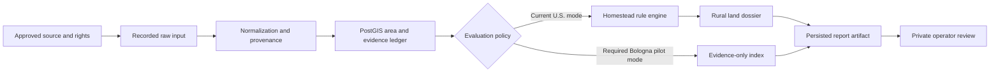
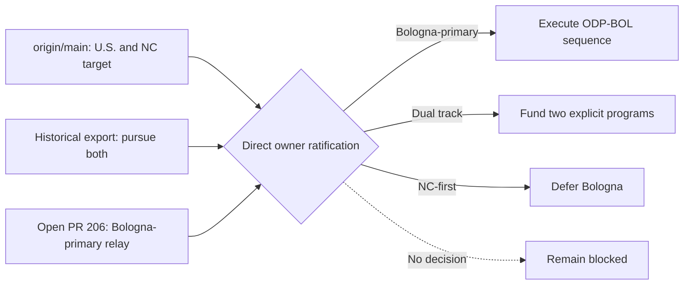
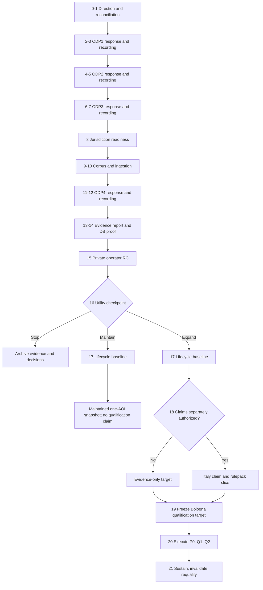

# Land Diligence Program Roadmap and Progress Ledger

Status: `program-roadmap-candidate`

Last reconciled: `2026-07-22`

Repository baseline: `origin/main@26d8b1342a2d0b1cf8435b6fad7b1542d3f097ae`

Active execution plan: `plans/2026-07-02-authority-evidence-intake.md`

This document is the durable program-level synthesis for what has been built, what
has been proven, what remains blocked, and how the project should advance. It is not
an authority record. It does not approve Bologna, a source, a corpus, a rulepack, a
runtime, a qualification transition, or a product release.

## Goal

Maintain one coherent, evidence-backed account from the repository foundation to the
intended product outcome, then define the smallest safe sequence that can turn the
existing scaffold into a useful private operator workflow without overstating evidence,
qualification, legal certainty, source rights, freshness, or owner intent.

The candidate target, if directly ratified by the owner, is a private/operator-only
Bologna pilot for one bounded parcel or site AOI. Its first report mode is evidence-only:
stored source observations, source failures, provenance, caveats, and as-of dates, with
no interpreted suitability result and no reuse of U.S. homestead claims.

## Non-goals

- This document does not replace `state/PROJECT_STATE.md`, the qualification catalog,
  source-rights records, accepted ADRs, or the active execution plan.
- It does not treat a Codex/Claude session, export, open PR, green CI run, or routine
  owner merge by itself as sufficient owner authority.
- It does not authorize live vendors, paid APIs, hosted production, Level 10, external
  users, a broad UI redesign, a generalized multi-jurisdiction framework, or a new
  Italy rulepack.
- It does not require universal TDD, duplicate validators, speculative abstractions, or
  tests for behavior that remains intentionally blocked.
- It does not assert legal access, buildability, title, water rights, wetland
  jurisdiction, surveyed boundaries, value, financing suitability, or investment advice.

## 1. Truth and authority model

| Question | Canonical evidence | What is not sufficient |
|---|---|---|
| What has landed? | Fetched `origin/main`, commit history, and files at that ref | Dirty root files, an open PR, or a session report |
| What is active? | `state/PROJECT_STATE.md`, `tasks/task_queue.yaml`, and the active plan, reconciled to live refs | An older checkpoint SHA or a superseded roadmap section |
| What did an agent do? | Task transcript plus matching branch/ref/files | Narrative claims without repository corroboration |
| What did the owner authorize? | A directly owner-authored/signed payload, or explicit authenticated owner ratification of exact enumerated decisions, with a stable locator and human provenance review | Agent inference, relay alone, a prefilled template, or routine merge without explicit ratification meaning |
| What source use is allowed? | Per-dataset source-rights record and cited terms | Catalog discovery, general portal terms, or technical accessibility |
| What runtime behavior is proven? | Relevant unit/contract checks plus isolated integration proof for persistence claims | Static artifact tests or default verify when DB smoke was skipped |
| What is empirically qualified? | `state/EMPIRICAL_QUALIFICATION_STATUS.yaml` under the frozen qualification contract | A freeze, fixture regression, green CI, pilot success, or informal calibration |

An owner-signed ADR may live inside this repository and still qualify as external to the
agent-inference chain. Explicit owner approval/merge may also ratify exact decisions when
the PR presents them as a ratification request and the authenticated owner action has that
recorded meaning. A routine merge does not fill blank decisions or authenticate agent
inference. An agent may scaffold structure but may not fill owner decisions. A human must
verify provenance because the evaluator validates shape and blocked-state invariants, not
authenticity.

### Current floor at reconciliation

| Surface | 2026-07-22 state |
|---|---|
| Live main | Local and fetched `origin/main` both `26d8b1342a2d0b1cf8435b6fad7b1542d3f097ae` |
| Active work | `AUTH-EVIDENCE-INTAKE`; task queue last reports 154 done, 10 blocked, 1 active |
| Qualification | `P0 = NOT_RUN`; default no-runtime status derivation `BLOCKED=0 NOT_RUN=21` |
| Bologna authority | ODP1 review-only pursuit answered; ODP2/3/4 missing owner answer; pilot/source records zero |
| Source authority | DS-002 is the sole approved source for the frozen NC/flood target; Bologna sources remain candidates |
| Proposal context | PR #206 and #207 carry the candidate roadmap/owner-context and scope-form work; `gh pr view` reported both open, non-draft, `CLEAN`, and unmerged on 2026-07-22, but refresh this transient status before action |
| Root checkout | Modified coordination inboxes plus untracked ADR/form/roadmap copies; treat as preservation state, not authority |
| 2026-07-21/22 main activity | Inspected `origin/main` remained at the baseline above; no runtime, schema, authority-record, or qualification-state change landed there during the reviewed window |
| 2026-07-22 PR #206 activity | The roadmap branch received documentation-only consolidation and adversarial correction work; this is planning progress, not landed runtime implementation |

## 2. Intended product state

The intended end state is not merely a generated document. It is a reproducible,
inspectable diligence compilation workflow in which:

1. An operator selects one explicitly bounded AOI and an allowed intent.
2. Only approved source fields are captured, with native source identifiers, source
   version/effective date, retrieval metadata, rights, caveats, and failure status.
3. Raw or recorded source material remains hash-bound; normalized geometry is stored in
   PostGIS with transformation provenance.
4. Every displayed factual observation traces to stored evidence. Missing, stale,
   conflicting, outside-coverage, and failed-source states remain visible.
5. Evidence-only reports make no suitability or legal conclusion. Any future interpreted
   claim requires a separately authorized jurisdiction/rulepack contract.
6. The report artifact can be reproduced from the same approved inputs and its persisted
   hash can be verified against the database metadata.
7. The private operator can inspect lineage, review caveats, and distinguish evidence,
   interpretation, confidence, and unresolved questions.
8. Qualification claims are made only from a separately frozen and executed Bologna
   qualification target, never inherited from the NC/flood proof-of-method.

## 3. Accomplishment ledger

`LANDED` means present on `origin/main`. `OPEN-PR` means reviewable but not canonical.
`BLOCKED` and `NOT_RUN` are honest states, not failures to be cosmetically removed.

| Milestone | State | Contribution toward the intended product | Explicit non-claim |
|---|---|---|---|
| Repository health and Windows verification | LANDED | Established unit, structural, qualification, and optional DB gates; CI installs and runs the lint/type toolchain | Local verify proves lint/type only when ruff and mypy are installed and actually run; default verify does not prove DB smoke ran |
| PostgreSQL/PostGIS schema spine | LANDED | Supplies system-of-record tables for sources, areas, evidence, claims, report metadata, and auditability | Presence of tables does not prove a production migration or Bologna data |
| Source registry and rights contracts | LANDED | Separates source identity, provenance, licensing, field use, retention, export, and failure policy | Candidate discovery does not approve a source |
| Area and geometry contracts | LANDED | Provides canonical AOI geometry validation and PostGIS storage in EPSG:4326 | Bologna source CRS and transformation precision are not yet resolved |
| Evidence ledger and source-failure handling | LANDED | Makes evidence lineage and failed retrievals first-class rather than silent no-issue results | Evidence existence does not authorize interpretation |
| Claim/rule and report-run contracts | LANDED for U.S./NC | Proves evidence-linked claims, deterministic report metadata, cautious language, and report artifacts | Current rules and dossier semantics are not geography-neutral |
| API, review, audit, and operator surfaces | LANDED | Provides intake, report generation, approval, lineage, comparison, download, and local operator workflows | A fixture-backed operator workflow is not live diligence or empirical utility proof |
| Selected NC county fixture closure | LANDED | Exercises Buncombe, Chatham, and Brunswick AOIs across expected and failure conditions | Fixtures are snapshots and cannot satisfy a fresh qualification cohort |
| Bounded U.S. live-connector paths | LANDED, default-off/review-gated | Demonstrates supervised retrieval, provenance, durable scheduling, review approval, and report resumption for selected public U.S. sources | Technical paths and restricted source approval do not make them Bologna sources, broadly production-ready, or automatically current |
| Extended-domain fixture ingestion | LANDED | Adds minerals, broadband, environmental, water, and geology evidence paths and demonstrates reusable connector-to-evidence mechanics | These U.S. sources and domain labels do not transfer automatically to Bologna |
| DB-backed report proof pattern | LANDED | Demonstrates fixture ingestion through persisted evidence/claim links to a DB-loaded report artifact | Existing proof uses U.S. claim/dossier semantics and is not ODP-BOL-004 |
| Readiness, retention, security, packaging, and deployment controls | LANDED as control plane | Makes release constraints inspectable and fail-closed | Many controls are blocked/not-run; their existence is not release readiness |
| Empirical qualification control plane and QFREEZE-2 | LANDED; execution NOT_RUN | Freezes a reproducible NC/flood/DS-002 target and prevents informal PASS claims | All 21 qualification cases remain NOT_RUN; Bologna inherits none of this validity |
| Bologna ODP/ODGAV gate family | LANDED as validate-only control plane | Defines owner-answer, source-rights, corpus, and DB-proof prerequisites in dependency order | Pilot/source records remain empty and no downstream implementation is authorized |
| Forward-roadmap and scope-form corrections | OPEN-PR #206/#207 | Produce reviewable decision and intake artifacts with corrected blocker language | Neither PR is canonical authority; both remain open and unmerged |

The project has therefore completed most reusable lower-layer mechanics, but it has not
completed the external facts that make a new geography legitimate: exact owner scope,
approved datasets and fields, recorded corpus, Bologna report semantics, runtime proof,
operator utility, or empirical qualification.

## 4. Recent progress and investigations

| Window | Work completed | Why it matters |
|---|---|---|
| Codex task `019f2153-e28a-7720-85ef-f5899b998add` | Reconciled main, PRs, root copies, qualification state, and the owner-facing Bologna toolkit; reported five significant wording/authority defects and performed only the authorized handoff writes | Prevented review-only, future-tense, or structurally valid agent text from being treated as real owner authority; it did not run the full verifier or change product code |
| Codex task `019f2158-87c5-7e12-adf1-0e39677535f6` | Stopped first on a false security-review relaxation, then corrected the candidate, added the pending direction record, ran qualification/full verification and remote CI, and left PR #206 open | Demonstrated stop-on-contradiction discipline and produced a reviewable docs branch without changing qualification values or claiming a merge |
| Claude export `session-455cf568-9a4f-46f1-9f6b-00c596e48880.md` | Preserved the historical "pursue both" signal, later Bologna-primary relay, and U.S. fixture-work context; supplied file SHA-256 at re-audit was `B5551523937C8B1501235FC1441E6BA69BA73647FC290D68E035154973FE5EBF` | Exposes decision history and intent drift, but cannot establish landing, current repo state, or direct owner authority by itself |
| 2026-07-21/22 adversarial re-audit | Re-read the planning corpus, runtime report path, persistence ordering, task histories, export, authority controls, and qualification state; found mode/input/idempotency/immutability and lifecycle sequencing omissions | Converts the candidate from a broad strategy narrative into an acceptance-oriented roadmap before Bologna data can enter U.S.-specific semantics |
| 2026-07-22 docs-branch window | Consolidated the program roadmap, corrected plan routing and P0 vocabulary, refreshed the state anchor, and specified the remaining gates | This advances planning coherence only; it does not approve Bologna, implement evidence-only reporting, execute a DB proof, or qualify a product |

### Planning-corpus status and routing

The dated inventory found 123 top-level plan Markdown files plus `plans/README.md`.
After fragment anchors are stripped, task `spec` values in `tasks/task_queue.yaml`
resolve to 101 distinct top-level plan files: 99 are associated only with done tasks,
`plans/2026-06-20-post-bsr-roadmap.md` has the plan-backed blocked task, and
`plans/2026-07-02-authority-evidence-intake.md` has the active task. Nine other blocked
tasks use `state/QUALIFICATION_PARAMETERIZATION_BACKLOG.md` as their spec; together with
the plan-backed blocker, they reconcile to the current 10 blocked tasks. The other 22
plan files are lane roots, umbrellas, historical analyses, or strategic candidates;
none becomes active from file presence.

| Non-task-spec plan group | Files | Routing classification |
|---|---|---|
| Foundational and lane roots | `2026-06-03-foundation-vertical-slice.md`, `2026-06-03-repo-audit-and-forward-options.md`, `2026-06-03-repo-bootstrap.md`, `lane-b-2026-06-03-area-geometry.md`, `lane-c-2026-06-03-evidence-claims.md` | Foundational/historical context; current lifecycle comes from state and task routing |
| Desktop experiment | `2026-06-04-codex-ipc-injection.md` | Separate orchestration experiment, not a land-product critical-path plan |
| Product/operator supporting plans | `2026-06-06-private-mvp-utility-proof.md`, `2026-06-06-source-readiness-closure.md`, `2026-06-10-operator-complete-surface.md`, `2026-06-14-operator-path.md`, `2026-06-17-ui-report-identity.md`, `2026-06-18-connector-review-workspace-scope.md`, `2026-06-18-report-artifact-path-trust.md`, `2026-06-18-ui-csrf-route-coverage.md` | Historical implementation context; landed behavior must be established from code, task history, and verification rather than these files alone |
| Maturity/control umbrellas | `2026-06-05-l10-production-hardening.md`, `2026-06-21-empirical-qualification-adoption.md`, `2026-06-21-eq-phase2-operationalize.md`, `2026-06-21-harden-control-plane.md`, `2026-06-28-harvest-readiness-modules.md` | Umbrella context; child plans, canonical catalogs, and task/state files control exact completion or deferral |
| CI proposal | `2026-07-06-ci-shard-speedup.md` | Historical/partially executed; current disposition is recorded at its top and in project state |
| Superseded strategy | `2026-07-07-forward-roadmap.md` | Retained at a stable referenced path and superseded by this candidate |
| Current strategy | `2026-07-22-program-roadmap.md` | Program-roadmap candidate; comprehensive context, not execution or owner authority |

This taxonomy is a dated routing aid, not a second task system. `plans/README.md`,
`tasks/task_queue.yaml`, and the top of `state/PROJECT_STATE.md` carry the current route;
mass-moving or relabeling all historical plans would add reference churn without reducing
a live implementation risk.

## 5. Architecture: reusable core and unsafe coupling



### Reusable boundaries

- Source identity, source-rights metadata, retrieval provenance, evidence contracts,
  source-failure events, area versioning, PostGIS storage, audit events, report metadata,
  object-store artifacts, review status, and operator authentication are reusable.
- The fixture workflow already supplies the right implementation pattern: capture first,
  validate and review, normalize with provenance, then admit evidence.
- The qualification catalog and readiness gates correctly separate proof states from
  aspiration, provided their results are not collapsed into one generic green signal.

### Fragile or non-modular boundaries

| Area | Current weakness | Likely consequence | Narrow correction |
|---|---|---|---|
| Report orchestration | `ReportRunService` combines evidence approval, synthetic failures, U.S. rules, claim creation, manifest building, and persistence | Bologna can inherit U.S. soil, septic, county, zoning, or homestead semantics | Add an explicit evaluation mode and bypass all U.S. synthesis in evidence-only mode |
| Intent/mode propagation | Report create, job, retry, and idempotency payload checks currently identify work by area plus intent; no evaluation mode exists | An evidence-only request can lose its mode or deduplicate against an interpreted U.S. run | Carry mode and policy through request, job payload/store, retry/resume, idempotency matching, service, response, and persisted artifact |
| Report input identity | The service loads all report-approved evidence for an area; the manifest does not bind exact evidence IDs, dataset versions, ingest runs, or AOI version/hash | A proof can silently mix stale, superseded, or out-of-corpus evidence from the same AOI | Require an immutable input-selection manifest and digest; reject missing, extra, or superseded evidence |
| Dossier rendering | The rural dossier is a large U.S.-specific renderer and can derive `screening_clear` from an empty claim set | A zero-claim Bologna report could falsely communicate clearance | Prohibit rural-dossier rendering for evidence-only reports and add a separate evidence index |
| Rule engine | The ruleset label is configurable but implementation conditions are hardcoded around the homestead MVP | A nominal new ruleset can appear modular while executing U.S. behavior | Do not add a Bologna ruleset until real claim requirements exist; refactor only from concrete duplication |
| Report contract compatibility | Zero claims are allowed, ruleset identifiers remain expected, and the v1 JSON schema rejects unknown top-level properties | A mode field can either fabricate ruleset semantics or break old readers/artifacts | New writers emit mode; missing mode on old v1 artifacts can mean only `interpreted_claims`; use v2 and dispatch if strict-consumer compatibility cannot be proven |
| Artifact and review lifecycle | Persistence writes the JSON artifact before DB flush, then review updates overwrite that same file; `reports.report_assets` has checksum/metadata columns but no application mapping | Failed inserts can orphan files, and review mutation can destroy the generation-time digest and reproducibility proof | Keep generation assets immutable, store review as a linked record or versioned derivative, register machine/human asset checksums, and prove orphan detection/reconciliation |
| ODP-BOL-004 gate | Current language expects claim-evidence links | Evidence-only execution could be forced to create fake claims | Require an explicitly empty claim-link set and human-reviewed zero-claim proof |
| Authority evaluation | Automated checks validate shape, citations, coverage, and no-unlock fields, not human authenticity | Well-formed agent-authored text can be mistaken for owner authority | Preserve signed input, hash it, map it side by side, and require human provenance attestation |
| Authority recording | Bologna-specific records can be updated without explicitly reconciling the production authority packet, evidence references, and follow-on sequence | Two nominal authority surfaces can disagree about what is unlocked | Every recording slice must update or intentionally preserve all four authority-routing surfaces and pass existing validators |
| Jurisdiction readiness | The current checklist/dry run is U.S. state/county and homestead oriented | Bologna can pass source gates while legal-language, review, and non-U.S. report boundaries remain undefined | Complete a Bologna-specific readiness delta or amend the checklist scope before capture/report implementation |
| Geometry provenance storage | Canonical contracts store EPSG:4326 geometry but do not provide typed native-CRS/raw-hash fields at every required layer | Transform metadata can be buried in generic JSON or lost, making spatial reproduction fragile | Bind raw/native CRS/hash to dataset/corpus manifests, per-observation method/version/precision to evidence, and AOI version/hash to report input; plan a minimal schema change only if those containers cannot round-trip it |
| Operator fixtures | Current cases and report language are NC/U.S.-specific | Reusing operator cases can create misleading labels and acceptance signals | Add only one Bologna-specific operator case after the corpus and report mode exist |
| Governance surface | More than 100 Bologna-related scripts/configs/tests/plans/runbooks exist before any approved source or fixture | More control-plane work produces churn without product learning | Freeze new gate families; consume existing gates in one vertical slice |
| Workspace state | Dirty root copies, many worktrees, and stale state SHA text coexist with open PRs | Pull collisions and inaccurate progress claims become likely | Use clean owned worktrees, preserve conflicting files, and reconcile state once per landed milestone |

## 6. Competing positions and consensus

### Geography and product direction

- Position A: continue NC because it is already implemented and qualification-frozen.
- Position B: make Bologna primary because the July 6 relay says it is the live product line.
- Position C: run both in parallel to preserve optionality.
- Consensus: this is an owner-value decision, not an engineering inference. If the July 6
  direction is directly ratified, Bologna-primary is the best fit because it avoids
  splitting scarce source, legal, operator, and qualification work. NC remains a frozen
  proof-of-method, not discarded code. Without ratification, implementation holds.

### Cross-geography architecture

- Position A: generalize the whole stack now with `LocalityProfile`, pluggable rulepacks,
  runtime profiles, and an authority classifier.
- Position B: duplicate the U.S. path for Bologna to move faster.
- Consensus: both are premature. Add only the one real policy boundary required now:
  evidence-only versus interpreted-claims evaluation. Extract a broader locality/profile
  abstraction only after a second implemented geography reveals repeated variation.

### Testing and governance

- Position A: require TDD and a checker for every new decision field.
- Position B: rely on manual review because this is a private pilot.
- Consensus: test according to consequence. Pure behavior receives focused regression
  tests, persisted claims receive real DB proof, legal/authority judgments receive human
  review, and unchanged blocked states receive no new tests. This avoids both under-proof
  and control-plane churn.

## 7. Strategic choices

| Choice | Best fit when | Benefits | Costs and consequences |
|---|---|---|---|
| A. Bologna-primary | The owner directly ratifies the July 6 direction | Focuses source review, report semantics, operator learning, and eventual qualification on the intended geography | Requires a new corpus, evidence-only report path, Bologna-specific qualification, and careful rights/CRS/language handling |
| B. Explicit dual track | The owner needs both products and funds two maintained cohorts | Preserves NC utility while Bologna develops | Duplicates source governance, product decisions, regression matrices, freshness work, and qualification; highest context-switch cost |
| C. NC-first, Bologna deferred | The owner does not ratify Bologna or values fastest use of the existing stack | Lowest immediate engineering change; reuses selected counties and DS-002 | Contradicts the pending direction and leaves Bologna gate investment unused |
| D. Hold | No direct authority arrives | Preserves integrity and prevents speculative implementation | Produces no product learning; only maintenance and decision intake remain justified |

Recommendation: choose A only after direct ratification. Until then, D is the only
authority-safe operational state. Do not infer B or C from sunk cost, silence, or open PRs.



## 8. Proposed Bologna pilot design

### Scope boundary

- One parcel or site AOI represented as a valid Polygon/MultiPolygon, plus optional
  context-buffer/locality metadata. A whole-municipality pilot is a different product
  scope and must not be selected implicitly.
- Private local operator only. Hosted production, public intake, billing, and external
  user identity are outside the current candidate target but their existing blockers
  remain intact.
- One or two source datasets are enough for the first vertical slice. Selecting every
  discovered Bologna source before utility is demonstrated is not justified.
- Before capture or report work, complete a Bologna/non-U.S. jurisdiction-readiness
  delta against `docs/checklists/jurisdiction_readiness.md`. The current U.S.
  state/county dry run cannot silently stand in for Italian scope, review, language,
  privacy, or report-semantics decisions.

### Data and evidence boundary

- Per-dataset rights review controls allowed fields, raw retention, caching, export,
  AI use, attribution, and redistribution. Portal-level terms are discovery context,
  not a substitute for dataset terms.
- Personal owner, address, contact, and identifier fields are default-denied. If a
  selected field contains personal data, trigger explicit privacy/legal review and
  document purpose, minimization, retention, and access.
- Preserve the Italian source text as authoritative. Any English translation is a
  derived convenience artifact with translator/method/version provenance.
- Every fixture records source/effective/retrieval dates and displays an `as of` date.
  A recorded fixture is reproducible, not current, unless a recapture policy says so.
- Define one immutable report-input identity: allowed evidence IDs or a corpus-selection
  digest, dataset-version IDs, ingest-run IDs, source IDs, AOI version/geometry hash,
  evaluation mode, and policy version. Reject extra, missing, or superseded evidence.
- Bologna source-derived observations and source failures require non-null dataset-version
  and ingest-run identity; area-only source approval is not a corpus boundary.
- Recapture creates a new dataset/corpus version rather than mutating an old one. Reports
  bind exact versions, and source/code/policy change explicitly expires or invalidates
  affected report and qualification evidence.
- Canonical geometry is EPSG:4326. Raw/native CRS and geometry hash belong in the
  dataset/corpus manifest; transform implementation/version, axis order, and precision
  belong on each derived observation; AOI version/hash belongs in the report-input
  manifest. If existing generic metadata cannot round-trip this contract, require a
  minimal planned schema/ADR change rather than burying it in display values.

### Evaluation and report boundary

- Treat the new report mode as a report-semantics/API change: write or update the
  execution plan and ADR before implementation, and preserve the current default mode.
- Select the product `intent_code` independently from evaluation mode. If no existing
  intent truthfully represents the Bologna use case, a new code requires coordinated SQL
  enum/seed, domain, request/schema, and UI changes; do not overload an unrelated intent.
- Add `evaluation_mode = evidence_only` and a versioned evaluation policy identifier,
  and carry both through create/schedule/execute/reload/retry/resume, idempotency
  scoping and payload comparison, API response, persistence, and rendering.
- New writers must emit mode. A missing mode on an old v1 artifact can default only to
  `interpreted_claims`, never evidence-only. Add an optional v1 field only if strict
  reader compatibility is proven; otherwise write an ADR and introduce v2 dispatch.
- In evidence-only mode, a documented policy identity such as
  `evidence_only_no_claims` replaces fabricated ruleset meaning. If existing required
  ruleset fields cannot express that honestly, version the contract.
- Evidence-only mode produces exactly zero interpreted claims, red flags, advisories,
  suitability labels, and synthetic U.S. unknown claims.
- It may display factual source coverage/failure status, evidence values, caveats,
  provenance, and explicit questions for professional review.
- API and UI download/render routes dispatch by mode. A fail-closed guard rejects
  rural-dossier rendering for evidence-only reports, including direct helper calls.
- The human artifact is an evidence index, not a rural-land dossier with blank sections.

### Persistence boundary

- Persist source, dataset/version, ingestion run, area version, exact input-selection
  manifest/digest, evidence rows, report metadata, and machine/human assets.
  `claim_evidence` count must be exactly zero.
- The generation-time machine JSON is immutable. Review decisions live in a separately
  linked/audited record or a versioned reviewed derivative with its own digest; review
  must not overwrite the only generation artifact.
- Register deterministic machine and human assets with renderer/policy version,
  storage URI, and checksum. Prefer the existing `reports.report_assets` table after an
  ADR/repository-fit check; add a migration only if a confirmed storage gap remains.
- Verify serialization, both asset hashes, reload, exact input/source/evidence lineage,
  and review linkage in one isolated Postgres/PostGIS plus object-store run.
- Decide and test the orphan-artifact policy for the current object-store-first then DB
  insert sequence. A failed DB transaction must be detectable and recoverable, and a
  missing/tampered registered asset must fail closed.

## 9. Bottom-up execution sequence

Every authority-recording step below must update or explicitly preserve, with reasons,
the same four production-routing surfaces: `state/PRODUCTION_AUTHORITY_PACKET.md`,
`config/production_authority_intake.yaml`,
`config/production_authority_evidence_references.yaml`, and
`config/authority_follow_on_sequence.yaml`. Existing validators must agree before merge.
`state/owner-decisions.md` is used only when the decision affects qualification; it is
not a general Bologna product/AOI authority ledger.

| Step | Work and output | Acceptance / PASS | Stop or FAIL consequence |
|---|---|---|---|
| 0. Direction closure | Direct owner choice among A/B/C/D plus the authority-record rule | Owner-authored/signed payload or explicit authenticated ratification, stable locator, human provenance review, no downstream unlock bundled | No product implementation; remain in authority intake |
| 1. PR/root reconciliation | Revise/merge/close #206/#207; preserve or archive conflicting root copies; use a clean owned worktree | Branch diff matches intended files, no untracked overwrite risk, canonical main refreshed | Do not pull over conflicting files or treat open PR text as landed |
| 2. ODP-BOL-001 response | Exact AOI, operator/use case, evidence-only mode, questions, non-goals, language, privacy, CRS, source limit, and stop conditions | All 12 decisions answered with cited owner evidence; evaluator and human externality review pass; unlock list remains empty | Missing/ambiguous answer keeps every downstream stage blocked |
| 3. ODP1 authority recording | Hash/preserve the signed response and transcribe it side by side into existing pilot-scope records plus the production-routing crosswalk | Exact mapping, reviewer attestation, cross-surface validators, and narrow recording PR pass | Any inferred value, transcription drift, authority-surface disagreement, or bundled downstream change blocks merge |
| 4. ODP-BOL-002/BSA response | Owner selects only source candidates for review and answers the exact per-source rights/field/retention/CRS/failure questions | Response gates pass and cited terms cover every selected dataset; no source is yet approved | Unknown/incompatible rights or personal-data ambiguity stops that source |
| 5. ODP2 authority recording | Record approved source identity, fields/use, rights, versions, reviewers, remaining blocks, and production-routing crosswalk | Recorded authority/rights/cross-surface validators and human cited-terms review pass before any corpus or connector change | A response alone cannot mutate rights rows, approve a source, or unlock capture |
| 6. ODP-BOL-003 response | Owner authorizes the exact AOI/source/version corpus boundary, capture method, raw retention, and success/failure cases | Corpus response gate passes with no capture or generated artifact side effect | Missing corpus authority keeps fixture capture and ingestion blocked |
| 7. ODP3 authority recording | Preserve/hash the response and record bounded corpus authority, pins, and the production-routing crosswalk | Recording PR contains only authorized records/pins and all corpus/cross-surface checks pass | Do not capture fixtures merely because an owner response exists |
| 8. Jurisdiction-readiness delta | Complete or amend the checklist for Bologna, Italian-language authority, privacy, professional-review boundaries, and evidence-only output | Named reviewer accepts every applicable item or records a blocking gap; no U.S. checklist assumption is inherited | Unresolved jurisdiction or report-language boundary stops capture/report implementation |
| 9. Corpus capture | Capture immutable success and no-data/failure fixtures plus the exact selection manifest | Hashes, source/dataset/ingest/AOI versions, raw/native metadata, dates, rights, caveats, transform provenance, and failure semantics validate | Empty/generated runtime, unreviewed source, scope drift, missing identity, or missing provenance fails closed |
| 10. Minimal ingestion | Add only selected fixture adapters and evidence normalization | Success and failure fixtures become version-bound evidence/source-failure rows; non-null dataset/ingest identity and no live calls are proven | No generic framework, live connector, UI, or claims expansion |
| 11. ODP-BOL-004 response | Owner confirms evidence-only report-proof semantics, exact input identity, required DB/assets/review evidence, reviewer, and empty claim-link policy | Human semantic review accepts the response; the existing incompatible claim-link wording remains a blocker until the recording slice amends it | Ambiguous mode, mutable artifact, or non-empty claim-link requirement blocks recording |
| 12. ODP4 authority recording | Record the accepted proof boundary, production crosswalk, and amend gate/checker/runbook fixtures to encode `claim_evidence_links: []` under the named policy | Recorded authority and updated gate agree on zero claims, exact inputs, immutable assets, and failure proof before report/DB/API work | A response or proposed gate edit alone cannot authorize implementation |
| 13. Evidence-only reporting | Approve the report-semantics plan/ADR; implement intent/mode separation, mode propagation, selection digest, v1/v2 compatibility, evidence index, and route-level rural-renderer guard | Create/job/retry/idempotency/reload paths preserve mode and input digest; old artifacts default only to interpreted mode; claims=0; no suitability/U.S. sentinel; as-of/caveats visible | Mode loss/collision, mixed corpus, interpreted clearance, default-mode regression, or U.S. leakage blocks progression |
| 14. ODP4 execution | Execute isolated Postgres/PostGIS plus object-store success and failure paths under the recorded boundary | Correct source/dataset/ingest/area/evidence/report rows, two registered asset hashes/reload, immutable generation payload, separate review linkage, claim links=0, source failure, tamper failure, and object-write/DB-fail recovery are proven | Mocks-only proof, skipped DB smoke, shared state, overwritten generation artifact, orphan without detection, or fabricated claim link is insufficient |
| 15. Private operator RC | Run one normal and one degraded local workflow with human review | Operator traces every value to exact inputs, distinguishes failure/unknown, reproduces both assets, and sees no false clearance | Fix only demonstrated workflow defects; do not broaden scope |
| 16. Utility checkpoint | Owner reviews the pilot against explicit questions, limitations, and operating cost | Choose stop/archive, maintain one-AOI snapshot, or authorize expansion with recorded reasons | A demo does not silently become a product or qualification cohort |
| 17. Lifecycle/security/recovery baseline | For any maintained or expanded pilot, implement recapture/expiry, invalidation, retention/purge, backup/restore, local security review, and workspace cleanup | Stale data expires visibly; new versions do not mutate old reports; restore and cleanup work; frozen independent-security requirements remain intact | One-shot artifacts may be archived, but no maintained/expanded or qualification claim proceeds without this baseline |
| 18. Optional interpreted claims | Only if separately authorized, define Italy-specific claim questions, rulepack, evidence linkage, professional review, report mode, and target impact | Jurisdiction review and targeted regression/DB evidence pass; every claim cites admitted evidence; evidence-only mode remains available | If authority or utility is absent, skip this step and retain evidence-only product semantics |
| 19. Bologna qualification freeze | After product mode and lifecycle are settled, authorize and freeze representative AOIs, source/corpus versions, target/profile, protocol, stop rules, reviewers, vault, and reproducer | Canonical catalog accepts a distinct Bologna target; evidence-only versus interpreted scope is explicit; no status is promoted by the freeze | NC/flood proof, one pilot AOI, Q3 probes, or informal calibration cannot substitute |
| 20. Qualification execution | Execute the frozen P0/Q1/Q2 sequence and record sealed evidence/results under canonical authority | Status changes only from accepted sealed evidence and authorized transition; every PASS is target-bound and reproducible | Missing, contaminated, stale, unsealed, or unreproducible evidence remains NOT_RUN/blocked as defined by the catalog |
| 21. Sustain and requalify | Monitor source terms/availability, recapture cadence, code/policy changes, asset integrity, recovery, incidents, and qualification invalidation | Change-impact rules expire affected reports/evidence and trigger bounded recapture/requalification; operations remain auditable | No indefinite-current snapshot or inherited PASS; stop/archive when maintenance cost exceeds utility |



## 10. Acceptance evidence and non-claims

| Gate | PASS proves | PASS does not prove |
|---|---|---|
| Owner-answer evaluator | Required structure, decision coverage, cited fields, and no requested unlocks | Owner authenticity, adequacy of evidence, or source permission |
| Human authority review | Signed provenance and faithful transcription | Technical feasibility or product utility |
| Authority crosswalk | Bologna and production-routing records agree about evidence and unlock state | Authenticity, source rights, implementation, or qualification |
| Source-rights review | The selected fields/use fit cited terms at review time | Legal advice, future terms, factual accuracy, or source availability |
| Jurisdiction-readiness review | Applicable Bologna scope/language/privacy/professional-review questions have an answer or explicit blocker | Legal correctness, source permission, utility, or qualification |
| Corpus validation | Exact source/dataset/ingest/AOI versions and fixtures are immutable, attributable, structurally valid, and cover success/failure | Current data, representative geography, or correct interpretation |
| Report-input identity | A run selected only the recorded evidence/corpus and rejected contamination | Correct source facts, interpretation, utility, or representative coverage |
| Mode/API/job checks | Evaluation mode and policy survive request, idempotency, job, retry, reload, and renderer dispatch without changing the old default | Persistence, product utility, or jurisdictional validity |
| Unit/contract checks | Changed pure behavior and invariants work for covered cases | Persistence, deployment, or real source behavior |
| DB/object-store proof | One isolated path preserves exact lineage, immutable machine/human asset digests, separate review linkage, and defined failure recovery | General scale, utility, freshness, or empirical qualification |
| Operator RC | The bounded workflow is usable and fails visibly for tested scenarios | Market demand, multi-user safety, jurisdictional validity, or broad coverage |
| Qualification PASS | The exact frozen target passed its sealed protocol | Unqualified domains, later data, other geographies, or legal conclusions |

## 11. Risk-proportionate verification policy

There is no universal TDD requirement. Tests are selected by the consequence of a
regression and by what the acceptance claim actually depends on.

- Authority-only documentation: run existing validators, citation/parity review, and
  `git diff --check`, including production-routing crosswalk validators. Add a regression
  test only if evaluator behavior changes.
- Jurisdiction readiness: reuse or amend the existing checklist with human review; do
  not create a new gate family merely to restate the same decisions.
- Source rights/corpus: use schema/checker validation plus human terms review. Tests
  cannot prove legal rights. Add one contamination/selection-digest check; do not
  duplicate every field in separate tests.
- Connector normalization: one success case, one explicit no-data/error case, and one
  fixture-to-evidence integration path per genuinely new adapter.
- Evidence-only reporting: test zero claims, no U.S. synthesis/suitability, visible
  as-of/caveats, mode/policy preservation across request/job/retry/idempotency/reload,
  old-v1 missing-mode fallback to interpreted mode, exact input selection, stable
  serialization/hash, and rejected rural-renderer calls. These are one focused contract
  matrix, not a test for every field.
- Persistence/report authority: require one real isolated Postgres/PostGIS and object-
  store round trip plus the object-write-success/DB-fail path, immutable-generation and
  separate-review proof, checksum/tamper failure, and reload. Mocks are supplemental.
  Set `RUN_DB_SMOKE=1`; do not treat default `verify: ok` with skipped DB smoke as proof.
- Operator/UI: test only changed routes and workflows. Run headed and headless browser
  smoke only if UI behavior is an acceptance target.
- Qualification: do not build speculative tests or runners until the target is
  authorized. Then test fail-closed handling for missing sealed results, unfrozen
  targets, contamination, stop rules, and missing reproduction metadata.
- Run narrow checks during a slice and the full `scripts/verify.ps1` gate once at PR
  handoff. Re-running the full suite after every text edit is churn, not assurance.

A new checker is justified only when it enforces a real invariant not already covered,
has a named consumer, and removes a credible ambiguity. Otherwise update the existing
human checklist or validator instead of adding another file family.

## 12. Files likely to change

This is a forecast, not authority to edit every listed file.

| Phase | Likely surfaces |
|---|---|
| Direction/scope | `docs/adr/`, PR #206/#207 documents, existing Bologna authority config, `state/PRODUCTION_AUTHORITY_PACKET.md`, `config/production_authority_intake.yaml`, `config/production_authority_evidence_references.yaml`, and `config/authority_follow_on_sequence.yaml`; use `state/owner-decisions.md` only for qualification-affecting decisions |
| Jurisdiction readiness | Existing `docs/checklists/jurisdiction_readiness.md` and its runbook/dry-run surfaces, amended narrowly for a non-U.S. evidence-only pilot |
| Source review | `docs/source-reviews/`, `config/bologna_source_candidates.yaml`, `config/bologna_source_rights.yaml`, source registry records |
| Corpus | Existing Bologna corpus config/gate files, bounded fixture locations, immutable source/dataset/ingest/AOI selection manifest and digest records |
| Geometry provenance | Dataset/corpus manifest, evidence method/version/precision, and AOI version/hash surfaces; domain/schema/migration only after a confirmed round-trip gap and approved plan/ADR |
| Ingestion | Selected modules under `backend/app/connectors/`, evidence adapter/workflow tests, no broad connector refactor |
| Report policy | Required ADR/update, `schemas/report_run_schema.json`, domain report/job contracts, `backend/app/api/reports.py`, job store/scheduling/idempotency, report service, mode-specific render/download routes, a small evidence-index renderer, and focused compatibility/overclaim/input-identity tests |
| DB proof | Report repositories/models, existing `reports.report_assets` storage if fit, immutable review linkage, object-store recovery, and DB-gated tests; migration only if a confirmed storage gap requires a plan and ADR |
| Operator RC | Existing operator/API route and runbook surfaces only where the Bologna workflow needs them |
| Lifecycle | Existing freshness, retention/purge, backup/restore, security-review, invalidation, and cleanup surfaces; extend only for a demonstrated Bologna gap |
| Qualification | `config/qualification/` and empirical status/evidence files only after separate owner authorization |
| State closeout | `state/PROJECT_STATE.md`, `state/WORKLOG.md`, and `state/VALIDATION_LOG.md` once per meaningful landed milestone |

## 13. Risk register

| Risk | Trigger | Mitigation / stop condition |
|---|---|---|
| False authority | Relay, agent-filled template, or merge treated as owner decision | Require signed owner payload, stable locator, hash, and human provenance review |
| Authority-surface divergence | Bologna records change without production packet/reference/follow-on reconciliation | Require the four-surface crosswalk and existing validators in every recording slice |
| Provenance-attribution blind spot | Positive fragment checks pass despite a false or missing attribution qualifier | Preserve author/approver separation and adversarial human review; add a negative guard only if the open owner decision selects CI enforcement |
| Source-rights incompatibility | Terms prohibit retention/export/AI/raw use | Exclude the source or narrow fields/use; do not code around the restriction |
| Personal-data ingestion | Owner/contact/address fields appear | Default deny; trigger privacy/legal review before capture |
| Jurisdiction-policy leakage | U.S. checklist, county language, or homestead assumptions stand in for Bologna | Complete the jurisdiction-readiness delta before capture/report work |
| CRS corruption | Unknown CRS, axis order, or unrecorded transform | Preserve native metadata and raw hash; fail before normalization |
| Translation drift | English convenience text differs from Italian authority | Preserve original, version translation, and cite both |
| Stale snapshot presented as current | No recapture/expiry policy | Display as-of/effective/retrieval dates and visibly expire stale evidence |
| Mixed or stale report input | Area-wide evidence lookup admits extra, superseded, or prior-corpus rows | Bind and verify exact evidence/dataset/ingest/AOI identity and selection digest |
| Mode/idempotency collision | Same area/intent/key is reused across evidence-only and interpreted requests | Include mode, policy, and selection digest in job payload, retry, idempotency scope, and payload match |
| U.S. semantic leakage | Current rule engine/dossier used for Bologna | Explicit mode dispatch and fail-closed renderer guard |
| False clean result | Empty claims produce `screening_clear` | Evidence-only reports have no suitability result by contract |
| Contract-version ambiguity | New mode is added to strict v1 schema or old missing mode is interpreted as evidence-only | New writers emit mode; old missing mode means interpreted; introduce v2 if compatibility is not proven |
| Fabricated claim links | ODP4 interpreted literally | Amend acceptance to require exactly zero links in evidence-only mode |
| Artifact/DB inconsistency | Object write succeeds and DB insert fails | Define orphan detection/cleanup or idempotent reconciliation and test it |
| Generation evidence mutation | Review overwrites the only report JSON or human rendering drifts without a digest | Keep generation assets immutable; separately link/version review; register both asset checksums and renderer version |
| Fixture contamination | Pilot fixture reused as qualification evidence without protocol | Separate pilot artifacts from sealed cohorts; qualification validator fails closed |
| One-AOI overgeneralization | Pilot success treated as Bologna validity | Mandatory utility checkpoint and separate representative qualification target |
| Premature qualification freeze | Target is frozen before product mode, lifecycle, security, recovery, or optional claim scope is settled | Complete lifecycle baseline and mode decision first; freeze and execute as separate authority steps |
| Missing invalidation cascade | Source, corpus, code, policy, or terms change while reports/PASS remain current | Version rather than mutate, expire affected artifacts/evidence, and trigger bounded requalification |
| Process bloat | New validator/plan added without new risk or consumer | Freeze gate creation and enforce the checker-justification rule above |
| Worktree/root collision | Open-PR files also exist untracked in root | Compare hashes, preserve/archive conflicts, and sync only from a clean owned worktree |
| State drift | Checkpoint SHA/status text lags live main | Reconcile once after PR/direction disposition, not in repeated cosmetic commits |

## 14. Verification commands

Run only the commands relevant to the changed phase, then the complete gate at handoff.

```powershell
# Planning/document integrity
git diff --check
python scripts\authority_evidence_intake_check.py --summary
python scripts\qualification_status_check.py --root .

# Full repository handoff gate
.\scripts\verify.ps1

# Persistence authority, only when DB/report behavior changes.
# Provision a disposable database first; do not use the shared/default URLs or store.
$env:DATABASE_URL_SYNC='<isolated-postgres-url>'
$env:DATABASE_URL='<same-isolated-postgres-via-psycopg-url>'
$env:OBJECT_STORE_ROOT='<fresh-isolated-object-store-path>'
$env:RUN_DB_SMOKE='1'
.\scripts\verify.ps1

# UI acceptance, only when UI behavior changes
.\scripts\run_ui_browser_smoke.ps1 -Mode both
```

Expected current control-plane signals remain: authority intake blocked, pilot/source
authority record counts zero, qualification `P0 = NOT_RUN`, and derived
`BLOCKED=0 NOT_RUN=21` under the default no-runtime checker mode. A checker returning
successfully means the blocked state is internally consistent; it does not mean the
blocked work is complete.

## 15. Evidence map

| Claim family | Primary repository evidence |
|---|---|
| Product and non-negotiables | `README.md`, `AGENTS.md`, `docs/PRODUCT_SPEC.md`, `docs/ARCHITECTURE.md` |
| Current operational state | `state/PROJECT_STATE.md`, `tasks/task_queue.yaml`, `state/WORKLOG.md`, fetched refs |
| Planning topology and lifecycle | `MANIFEST.md`, `plans/README.md`, `.agent/PLANS.md`, task `spec`/status entries in `tasks/task_queue.yaml`, top status/supersession markers |
| Verification semantics | `scripts/verify.ps1`, `.github/workflows/ci.yml`, `docs/TESTING.md`, `state/VALIDATION_LOG.md` |
| Database/evidence/report spine | `db/migrations/0001_initial_spine.sql`, `backend/app/domain/`, `backend/app/reports/`, DB-gated tests |
| Report input/mode/idempotency gaps | `backend/app/reports/service.py`, `backend/app/domain/report_contracts.py`, `backend/app/api/reports.py`, `backend/app/reports/job_store.py`, `schemas/report_run_schema.json` |
| Artifact ordering, review mutation, and asset capacity | `backend/app/reports/report_repo.py`, `backend/app/reports/models.py`, `reports.report_assets` and `reports.report_runs` in the initial migration |
| Geometry provenance capacity | `backend/app/domain/area_contracts.py`, `backend/app/domain/evidence_contracts.py`, area/evidence/source dataset-version tables and manifests |
| Current U.S. rules and dossier coupling | `config/ruleset_homestead_mvp.yaml`, `backend/app/claims_engine/rule_engine.py`, `backend/app/reports/dossier.py` |
| Bologna candidate and rights state | `config/bologna_source_candidates.yaml`, `config/bologna_source_rights.yaml`, `docs/source-reviews/bologna-*` |
| Bologna jurisdiction readiness | `MILESTONE_MAP.md`, `docs/checklists/jurisdiction_readiness.md`, `config/checklist_dry_run.yaml` |
| Bologna authority and sequencing | Active authority plan, `config/bologna_*`, existing ODP runbooks/checkers, production authority packet/intake/evidence-reference/follow-on surfaces, PR #206/#207 |
| Qualification authority | `config/qualification/qualification_targets.yaml`, `config/qualification/qualification_profiles.yaml`, `state/EMPIRICAL_QUALIFICATION_STATUS.yaml` |
| Session history used as context | The two Codex task IDs in section 4 and the supplied Claude export; neither overrides repository authority |

When these sources disagree, live `origin/main` and the canonical state/qualification
files control landed status; a direct owner record controls owner intent; runtime and
qualification claims require their own acceptance evidence.

## 16. Decision log

- 2026-06: The project built the bottom-up U.S./NC evidence, claim, report, API,
  review, operator, and fixture spine. This remains reusable proof-of-method.
- 2026-07-02: `AUTH-EVIDENCE-INTAKE` became the active plan because further Bologna,
  source, hosted, and qualification work required external facts rather than code.
- 2026-07-06: A relay-delivered direction stated Bologna-primary, private/operator-only,
  and deferred the heavy NC/flood P0 bundle. It is preserved as pending direction, not
  silently upgraded to direct authority.
- 2026-07-09: PR #206/#207 follow-ups corrected security/blocker wording, source count,
  authority phrasing, and future-tense merge overclaim; both remain open.
- 2026-07-21: Adversarial review rejected direct reuse of the U.S. report path for an
  evidence-only Bologna pilot and added the post-pilot utility checkpoint.
- 2026-07-22: This roadmap superseded the append-only July 7 analysis. Earlier NC-first,
  A-prep-now, and Bologna-first arguments are retained in Git history but no longer
  compete as multiple operative sections.
- 2026-07-22: The second adversarial pass rejected both a service-only mode flag and a
  speculative multi-jurisdiction framework. The selected minimum boundary is mode plus
  exact input identity propagated end to end, with broader extraction deferred until a
  second implemented geography demonstrates concrete duplication.
- 2026-07-22: Lifecycle/security/recovery and optional claim scope were moved before
  Bologna qualification freeze; freeze and empirical execution remain separate steps.

## 17. Progress log

- 2026-07-22: Reconciled `origin/main`, open PR #206/#207, the active authority plan,
  worktree ownership, both authorized Codex tasks, and the Claude export.
- 2026-07-22: Consolidated accomplishments, non-claims, architecture risks, strategic
  options, acceptance semantics, anti-bloat verification, and the complete future
  sequence into this program roadmap.
- 2026-07-22: Classified all 101 task-spec plans and the 22 non-task-spec plan surfaces,
  clarified the current router, corrected stale P0/CI/state labels, and avoided a mass
  archive or a new plan-status checker.
- 2026-07-22: Added explicit acceptance for authority crosswalk, jurisdiction readiness,
  corpus selection digest, mode/job/idempotency propagation, old-artifact compatibility,
  immutable machine/human assets, separate review linkage, orphan recovery, invalidation,
  and lifecycle-before-qualification ordering.

## 18. Maintenance rule

Update this roadmap only when one of these changes materially: owner direction, intended
product boundary, architecture, a major milestone state, the critical path, or a
significant risk. Operational status belongs in `state/PROJECT_STATE.md`; exact test
evidence belongs in `state/VALIDATION_LOG.md`; chronological implementation detail belongs
in `state/WORKLOG.md`; active implementation detail belongs in the current execution plan.

At each roadmap update:

1. Fetch and identify the live `origin/main` baseline.
2. Separate landed, open-PR, local-only, owner-gated, and inferred claims.
3. Update milestone and risk rows rather than appending a competing operative narrative.
4. Preserve explicit non-claims next to every readiness or qualification statement.
5. When active/superseded routing changes, update `plans/README.md`, task routing, and the
   top project-state checkpoint together; preserve stable historical paths unless a
   deliberate reference-update slice justifies moving them.
6. Re-run only the evidence checks needed for changed assertions.
