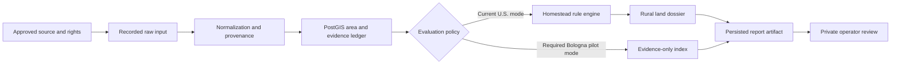
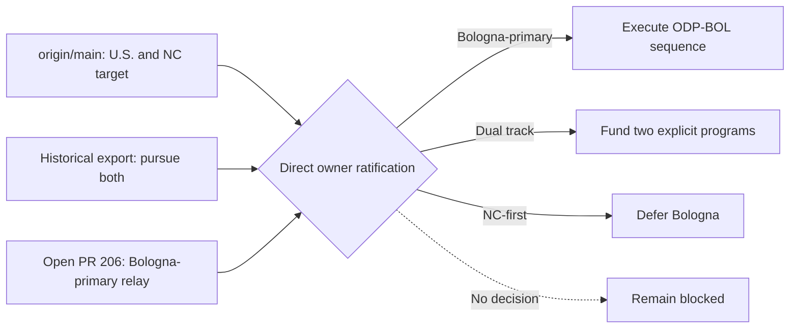
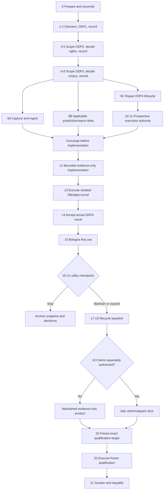

# Land Diligence Program Roadmap and Progress Ledger

Status: `program-roadmap-candidate`

Last reconciled: `2026-07-22`

Repository baseline: `origin/main@26d8b1342a2d0b1cf8435b6fad7b1542d3f097ae`

Active execution plan: `plans/2026-07-02-authority-evidence-intake.md`

This document is the durable program-level synthesis for what has been built, what
has been proven, what remains blocked, and how the project should advance. It is not
an authority record. It does not approve Bologna, a source, a corpus, a rulepack, a
runtime, a qualification transition, or a product release.

## Goal

Maintain one coherent, evidence-backed account from the repository foundation to the
intended product outcome, then define the smallest safe sequence that can turn the
existing scaffold into a useful private operator workflow without overstating evidence,
qualification, legal certainty, source rights, freshness, or owner intent.

The candidate target, if directly ratified by the owner, is a private/operator-only
Bologna pilot for one bounded parcel or site AOI. Its first report mode is evidence-only:
stored source observations, source failures, provenance, caveats, and as-of dates, with
no interpreted suitability result and no reuse of U.S. homestead claims.

## Non-goals

- This document does not replace `state/PROJECT_STATE.md`, the qualification catalog,
  source-rights records, accepted ADRs, or the active execution plan.
- It does not treat a Codex/Claude session, export, open PR, green CI run, or routine
  owner merge by itself as sufficient owner authority.
- It does not authorize live vendors, paid APIs, hosted production, Level 10, external
  users, a broad UI redesign, a generalized multi-jurisdiction framework, or a new
  Italy rulepack.
- It does not require universal TDD, duplicate validators, speculative abstractions, or
  tests for behavior that remains intentionally blocked.
- It does not assert legal access, buildability, title, water rights, wetland
  jurisdiction, surveyed boundaries, value, financing suitability, or investment advice.

## 1. Truth and authority model

| Question | Canonical evidence | What is not sufficient |
|---|---|---|
| What has landed? | Fetched `origin/main`, commit history, and files at that ref | Dirty root files, an open PR, or a session report |
| What is active? | `state/PROJECT_STATE.md`, `tasks/task_queue.yaml`, and the active plan, reconciled to live refs | An older checkpoint SHA or a superseded roadmap section |
| What did an agent do? | Task transcript plus matching branch/ref/files | Narrative claims without repository corroboration |
| What did the owner authorize? | A directly owner-authored/signed payload, or explicit authenticated owner ratification of exact enumerated decisions, with a stable locator and human provenance review | Agent inference, relay alone, a prefilled template, or routine merge without explicit ratification meaning |
| What source use is allowed? | Per-dataset source-rights record and cited terms | Catalog discovery, general portal terms, or technical accessibility |
| What runtime behavior is proven? | Relevant unit/contract checks plus isolated integration proof for persistence claims | Static artifact tests or default verify when DB smoke was skipped |
| What is empirically qualified? | `state/EMPIRICAL_QUALIFICATION_STATUS.yaml` under the frozen qualification contract | A freeze, fixture regression, green CI, pilot success, or informal calibration |

An owner-signed ADR may live inside this repository and still qualify as external to the
agent-inference chain. Explicit owner approval/merge may also ratify exact decisions when
the PR presents them as a ratification request and the authenticated owner action has that
recorded meaning. A routine merge does not fill blank decisions or authenticate agent
inference. An agent may scaffold structure but may not fill owner decisions. A human must
verify provenance because the evaluator validates shape and blocked-state invariants, not
authenticity.

### Current floor at reconciliation

| Surface | 2026-07-22 state |
|---|---|
| Live main | Local and fetched `origin/main` both `26d8b1342a2d0b1cf8435b6fad7b1542d3f097ae` |
| Active work | `AUTH-EVIDENCE-INTAKE`; task queue last reports 154 done, 10 blocked, 1 active |
| Qualification | `P0 = NOT_RUN`; default no-runtime status derivation `BLOCKED=0 NOT_RUN=21` |
| Bologna authority | ODP1 review-only pursuit answered; ODP2/3/4 missing owner answer; pilot/source records zero |
| Source authority | DS-002 is the sole approved source for the frozen NC/flood target; Bologna sources remain candidates |
| Proposal context | PR #206 and #207 carry the candidate roadmap/owner-context and scope-form work; `gh pr view` reported both open, non-draft, `CLEAN`, and unmerged on 2026-07-22, but refresh this transient status before action |
| Root checkout | Modified coordination inboxes plus untracked ADR/form/roadmap copies; treat as preservation state, not authority |
| 2026-07-21/22 main activity | Inspected `origin/main` remained at the baseline above; no runtime, schema, authority-record, or qualification-state change landed there during the reviewed window |
| 2026-07-22 PR #206 activity | The roadmap branch received documentation-only consolidation and adversarial correction work; this is planning progress, not landed runtime implementation |

## 2. Intended product state

The intended end state is not merely a generated document. It is a reproducible,
inspectable diligence compilation workflow in which:

1. An operator selects one explicitly bounded AOI and an allowed intent.
2. Only approved source fields are captured, with native source identifiers, source
   version/effective date, retrieval metadata, rights, caveats, and failure status.
3. Raw or recorded source material remains hash-bound; normalized geometry is stored in
   PostGIS with transformation provenance.
4. Every displayed factual observation traces to stored evidence. Missing, stale,
   conflicting, outside-coverage, and failed-source states remain visible.
5. Evidence-only reports make no suitability or legal conclusion. Any future interpreted
   claim requires a separately authorized jurisdiction/rulepack contract.
6. The report artifact can be reproduced from the same approved inputs and its persisted
   hash can be verified against the database metadata.
7. The private operator can inspect lineage, review caveats, and distinguish evidence,
   interpretation, confidence, and unresolved questions.
8. Qualification claims are made only from a separately frozen and executed Bologna
   qualification target, never inherited from the NC/flood proof-of-method.

### Usability maturity ladder

"Can start being used" is not one state. The project needs four explicit levels so a
one-AOI learning exercise does not inherit the cost of maintained or qualified operation.

| Level | Honest meaning | Entry evidence | Work deliberately outside the level |
|---|---|---|---|
| U0. Packaged rehearsal | The landed NC selected-county fixture workflow can be run through its local API/UI/runbook to rehearse operator mechanics | Existing `private_mvp_beta` gates, nine packaged cases, approved-report routes, lineage UI, and prior DB/browser proof | Current source facts, Bologna coverage, arbitrary AOIs, empirical utility, and qualification |
| U1. Bologna first-use RC | One private operator can use one recorded Bologna AOI and one or two approved dataset/field groups to obtain an evidence-only index through one named Bologna-specific local entrypoint | Direct scope/source/corpus/execution authority; operator-question source fit; server-resolved corpus identity; executable field projection; normal and degraded runs; isolated DB/object-store proof; immutable machine and human outputs; zero claims; non-implementer operator completion and utility review | Generic async/retry expansion unless explicitly selected, recurring freshness, automated reconciliation, broad source/domain coverage, interpreted Italy claims, hosted use, and qualification |
| U2. Maintained private operation | The accepted U1 workflow can be repeated without presenting stale or unrecoverable state as current | Recapture/expiry and invalidation, retention/purge, backup/restore, automated or routinely operated reconciliation, local security review, operating ownership, and bounded monitoring | External users, broad geography, and interpreted claims unless separately authorized |
| U3. Interpreted or qualified product | A separately authorized Italy rulepack and/or frozen Bologna qualification target has target-bound evidence | Jurisdiction-specific claim contract, representative cohort, sealed protocol, accepted results, and change-triggered requalification | Any geography, source, domain, or legal conclusion outside the exact accepted target |

U0 is available as a fixture rehearsal; it is not the intended Bologna utility result.
The shortest honest path to new product learning ends at U1/step 16 below. U2 and U3
must not be placed on that first-use critical path unless the owner chooses to maintain,
expand, interpret, or qualify the pilot.

For U1, a **degraded run** means an authorized retrieval produced a recorded source
failure or explicit no-data result that remains visible beside any unaffected admitted
evidence. It is not a fallback for a missing manifest member, stale or extra evidence,
checksum mismatch, tampering, or DB/object-store failure; those integrity failures must
produce no successful report.

## 3. Accomplishment ledger

`LANDED` means present on `origin/main`. `OPEN-PR` means reviewable but not canonical.
`BLOCKED` and `NOT_RUN` are honest states, not failures to be cosmetically removed.

| Milestone | State | Contribution toward the intended product | Explicit non-claim |
|---|---|---|---|
| Repository health and Windows verification | LANDED | Established unit, structural, qualification, and optional DB gates; CI installs and runs the lint/type toolchain | Local verify proves lint/type only when ruff and mypy are installed and actually run; default verify does not prove DB smoke ran |
| PostgreSQL/PostGIS schema spine | LANDED | Supplies system-of-record tables for sources, areas, evidence, claims, report metadata, and auditability | Presence of tables does not prove a production migration or Bologna data |
| Source registry and rights contracts | LANDED | Separates source identity, provenance, licensing, field use, retention, export, and failure policy | Candidate discovery does not approve a source |
| Area and geometry contracts | LANDED | Provides canonical AOI geometry validation and PostGIS storage in EPSG:4326 | Bologna source CRS and transformation precision are not yet resolved |
| Evidence ledger and source-failure handling | LANDED | Makes evidence lineage and failed retrievals first-class rather than silent no-issue results | Evidence existence does not authorize interpretation |
| Claim/rule and report-run contracts | LANDED for U.S./NC | Proves evidence-linked claims, deterministic report metadata, cautious language, and report artifacts | Current rules and dossier semantics are not geography-neutral |
| API, review, audit, and operator surfaces | LANDED | Provides intake, report generation, approval, lineage, comparison, download, and local operator workflows | A fixture-backed operator workflow is not live diligence or empirical utility proof |
| Selected NC county fixture closure | LANDED | Exercises Buncombe, Chatham, and Brunswick AOIs across expected and failure conditions | Fixtures are snapshots and cannot satisfy a fresh qualification cohort |
| Bounded U.S. live-connector paths | LANDED, default-off/review-gated | Demonstrates supervised retrieval, provenance, durable scheduling, review approval, and report resumption for selected public U.S. sources | Technical paths and restricted source approval do not make them Bologna sources, broadly production-ready, or automatically current |
| Extended-domain fixture ingestion | LANDED | Adds minerals, broadband, environmental, water, and geology evidence paths and demonstrates reusable connector-to-evidence mechanics | These U.S. sources and domain labels do not transfer automatically to Bologna |
| DB-backed report proof pattern | LANDED | Demonstrates fixture ingestion through persisted evidence/claim links to a DB-loaded report artifact | Existing proof uses U.S. claim/dossier semantics and is not ODP-BOL-004 |
| Readiness, retention, security, packaging, and deployment controls | LANDED as control plane | Makes release constraints inspectable and fail-closed | Many controls are blocked/not-run; their existence is not release readiness |
| Empirical qualification control plane and QFREEZE-2 | LANDED; execution NOT_RUN | Freezes a reproducible NC/flood/DS-002 target and prevents informal PASS claims | All 21 qualification cases remain NOT_RUN; Bologna inherits none of this validity |
| Bologna ODP/ODGAV gate family | LANDED as validate-only control plane | Defines owner-answer, source-rights, corpus, and DB-proof prerequisites in dependency order | Pilot/source records remain empty and no downstream implementation is authorized |
| Forward-roadmap and scope-form corrections | OPEN-PR #206/#207 | Produce reviewable decision and intake artifacts with corrected blocker language | Neither PR is canonical authority; both remain open and unmerged |

The project has therefore completed most reusable lower-layer mechanics, but it has not
completed the external facts that make a new geography legitimate: exact owner scope,
approved datasets and fields, recorded corpus, Bologna report semantics, runtime proof,
operator utility, or empirical qualification.

## 4. Recent progress and investigations

| Window | Work completed | Why it matters |
|---|---|---|
| Codex task `019f2153-e28a-7720-85ef-f5899b998add` | Reconciled main, PRs, root copies, qualification state, and the owner-facing Bologna toolkit; reported five significant wording/authority defects and performed only the authorized handoff writes | Prevented review-only, future-tense, or structurally valid agent text from being treated as real owner authority; it did not run the full verifier or change product code |
| Codex task `019f2158-87c5-7e12-adf1-0e39677535f6` | Stopped first on a false security-review relaxation, then corrected the candidate, added the pending direction record, ran qualification/full verification and remote CI, and left PR #206 open | Demonstrated stop-on-contradiction discipline and produced a reviewable docs branch without changing qualification values or claiming a merge |
| Claude export `session-455cf568-9a4f-46f1-9f6b-00c596e48880.md` | Preserved the historical "pursue both" signal, later Bologna-primary relay, and U.S. fixture-work context; supplied file SHA-256 at re-audit was `B5551523937C8B1501235FC1441E6BA69BA73647FC290D68E035154973FE5EBF` | Exposes decision history and intent drift, but cannot establish landing, current repo state, or direct owner authority by itself |
| 2026-07-21/22 adversarial re-audit | Re-read the planning corpus, runtime report path, persistence ordering, task histories, export, authority controls, and qualification state; found mode/input/idempotency/immutability and lifecycle sequencing omissions | Converts the candidate from a broad strategy narrative into an acceptance-oriented roadmap before Bologna data can enter U.S.-specific semantics |
| 2026-07-22 docs-branch window | Consolidated the program roadmap, corrected plan routing and P0 vocabulary, refreshed the state anchor, and specified the remaining gates | This advances planning coherence only; it does not approve Bologna, implement evidence-only reporting, execute a DB proof, or qualify a product |

### Planning-corpus status and routing

The dated inventory found 123 top-level plan Markdown files plus `plans/README.md`.
After fragment anchors are stripped, task `spec` values in `tasks/task_queue.yaml`
resolve to 101 distinct top-level plan files: 99 are associated only with done tasks,
`plans/2026-06-20-post-bsr-roadmap.md` has the plan-backed blocked task, and
`plans/2026-07-02-authority-evidence-intake.md` has the active task. Nine other blocked
tasks use `state/QUALIFICATION_PARAMETERIZATION_BACKLOG.md` as their spec; together with
the plan-backed blocker, they reconcile to the current 10 blocked tasks. The other 22
plan files are lane roots, umbrellas, historical analyses, or strategic candidates;
none becomes active from file presence.

| Non-task-spec plan group | Files | Routing classification |
|---|---|---|
| Foundational and lane roots | `2026-06-03-foundation-vertical-slice.md`, `2026-06-03-repo-audit-and-forward-options.md`, `2026-06-03-repo-bootstrap.md`, `lane-b-2026-06-03-area-geometry.md`, `lane-c-2026-06-03-evidence-claims.md` | Foundational/historical context; current lifecycle comes from state and task routing |
| Desktop experiment | `2026-06-04-codex-ipc-injection.md` | Separate orchestration experiment, not a land-product critical-path plan |
| Product/operator supporting plans | `2026-06-06-private-mvp-utility-proof.md`, `2026-06-06-source-readiness-closure.md`, `2026-06-10-operator-complete-surface.md`, `2026-06-14-operator-path.md`, `2026-06-17-ui-report-identity.md`, `2026-06-18-connector-review-workspace-scope.md`, `2026-06-18-report-artifact-path-trust.md`, `2026-06-18-ui-csrf-route-coverage.md` | Historical implementation context; landed behavior must be established from code, task history, and verification rather than these files alone |
| Maturity/control umbrellas | `2026-06-05-l10-production-hardening.md`, `2026-06-21-empirical-qualification-adoption.md`, `2026-06-21-eq-phase2-operationalize.md`, `2026-06-21-harden-control-plane.md`, `2026-06-28-harvest-readiness-modules.md` | Umbrella context; child plans, canonical catalogs, and task/state files control exact completion or deferral |
| CI proposal | `2026-07-06-ci-shard-speedup.md` | Historical/partially executed; current disposition is recorded at its top and in project state |
| Superseded strategy | `2026-07-07-forward-roadmap.md` | Retained at a stable referenced path and superseded by this candidate |
| Current strategy | `2026-07-22-program-roadmap.md` | Program-roadmap candidate; comprehensive context, not execution or owner authority |

This taxonomy is a dated routing aid, not a second task system. `plans/README.md`,
`tasks/task_queue.yaml`, and the top of `state/PROJECT_STATE.md` carry the current route;
mass-moving or relabeling all historical plans would add reference churn without reducing
a live implementation risk.

## 5. Architecture: reusable core and unsafe coupling



### Reusable boundaries

- Source identity, source-rights metadata, retrieval provenance, evidence contracts,
  source-failure events, area versioning, PostGIS storage, audit events, report metadata,
  object-store artifacts, review status, and operator authentication are reusable.
- The fixture workflow already supplies the right implementation pattern: capture first,
  validate and review, normalize with provenance, then admit evidence.
- The qualification catalog and readiness gates correctly separate proof states from
  aspiration, provided their results are not collapsed into one generic green signal.

### Fragile or non-modular boundaries

| Area | Current weakness | Likely consequence | Narrow correction |
|---|---|---|---|
| Report orchestration | `ReportRunService` combines evidence approval, synthetic failures, U.S. rules, claim creation, manifest building, and persistence | Bologna can inherit U.S. soil, septic, county, zoning, or homestead semantics | Add an explicit evaluation mode and bypass all U.S. synthesis in evidence-only mode |
| Intent/mode propagation | Generic report create, job, retry, and idempotency paths identify work by area plus intent; no evaluation mode exists | A broad first-use change expands the queue/retry compatibility surface, while an unguarded generic path can still route Bologna into U.S. semantics | Carry mode/policy/input identity through the one selected U1 route, service, persistence, response, and renderer; make every other create/job/retry route reject `evidence_only` until U2 unless ODP1 explicitly selects generic async operation |
| Report input identity | The service loads all report-approved evidence for an area; the request and manifest do not bind a recorded corpus, exact evidence, dataset/ingest versions, or AOI version/hash | A proof can silently mix stale, superseded, caller-selected, or out-of-corpus evidence from the same AOI | Bind a server-resolved recorded `corpus_id` and immutable input-manifest digest; reject missing, extra, superseded, unallowlisted, or mismatched evidence |
| Dossier rendering | The rural dossier is a large U.S.-specific renderer and can derive `screening_clear` from an empty claim set | A zero-claim Bologna report could falsely communicate clearance | Prohibit rural-dossier rendering for evidence-only reports and add a separate evidence index |
| Rule engine | The ruleset label is configurable but implementation conditions are hardcoded around the homestead MVP | A nominal new ruleset can appear modular while executing U.S. behavior | Do not add a Bologna ruleset until real claim requirements exist; refactor only from concrete duplication |
| Report contract compatibility | Zero claims are allowed, ruleset identifiers remain expected, and the v1 JSON schema rejects unknown top-level properties | A mode field can either fabricate ruleset semantics or break old readers/artifacts | New writers emit mode; missing mode on old v1 artifacts can mean only `interpreted_claims`; use v2 and dispatch if strict-consumer compatibility cannot be proven |
| Artifact and review lifecycle | Persistence writes the JSON artifact before DB flush, then review updates overwrite that same file; `reports.report_assets` has checksum/metadata columns but no application mapping | Failed inserts can orphan files, and review mutation can destroy the generation-time digest and reproducibility proof | Keep generation assets immutable, link/version review separately, register both checksums, prove U1 orphan detection and bounded cleanup, and defer automated reconciliation to U2 |
| ODP2/3 candidate scope | ODP2 evaluation requires source-authority records for all seven `candidate_review_ids`, and ODP3 catalogs all seven candidates, while the proposed pilot needs only one or two selected datasets | The project can spend a full rights/corpus pass on sources that do not answer the operator's questions | After ODP1 selection, parameterize the existing gates to the exact selected set; record excluded/deferred IDs without requiring full authority records for them |
| ODP-BOL-004 lifecycle | The response gate requires an actual DB report-run ID, evidence rows, and artifact references while also prohibiting DB runs and report artifacts until the response is later recorded; it also expects claim-evidence links | The gate is circular, and evidence-only execution could be forced to invent placeholders or fake claims | Split the existing ODP4 contract into prospective execution authorization and post-execution proof acceptance; require `claim_evidence_links: []`; do not add another gate family |
| Authority evaluation | Automated checks validate shape, citations, coverage, and no-unlock fields, not human authenticity | Well-formed agent-authored text can be mistaken for owner authority | Preserve signed input, hash it, map it side by side, and require human provenance attestation |
| Authority recording | Bologna-specific records can be updated without explicitly reconciling the production authority packet, evidence references, and follow-on sequence | Two nominal authority surfaces can disagree about what is unlocked | Every recording slice must update or intentionally preserve all four authority-routing surfaces and pass existing validators |
| Jurisdiction readiness | The current checklist/dry run is U.S. state/county and homestead oriented and includes generated-sample/production items | Requiring every item before capture creates churn or a dependency cycle, while skipping review can leak U.S. language | Stage one applicability map: pre-generation decisions before implementation, sample review after generation, production items at U2, and Italy rulepack items only after interpreted-claim authority |
| Geometry provenance storage | Canonical contracts store EPSG:4326 geometry but do not provide typed native-CRS/raw-hash fields at every required layer | Transform metadata can be buried in generic JSON or lost, making spatial reproduction fragile | Bind raw/native CRS/hash to dataset/corpus manifests, per-observation method/version/precision to evidence, and AOI version/hash to report input; plan a minimal schema change only if those containers cannot round-trip it |
| Operator fixtures | Current cases and report language are NC/U.S.-specific | Reusing operator cases can create misleading labels and acceptance signals | Add only one Bologna-specific operator case after the corpus and report mode exist |
| Governance surface | More than 100 Bologna-related scripts/configs/tests/plans/runbooks exist before any approved source or fixture | More control-plane work produces churn without product learning | Freeze new gate families; consume existing gates in one vertical slice |
| Workspace state | Dirty root copies, many worktrees, and stale state SHA text coexist with open PRs | Pull collisions and inaccurate progress claims become likely | Use clean owned worktrees, preserve conflicting files, and reconcile state once per landed milestone |

## 6. Competing positions and consensus

### Geography and product direction

- Position A: continue NC because it is already implemented and qualification-frozen.
- Position B: make Bologna primary because the July 6 relay says it is the live product line.
- Position C: run both in parallel to preserve optionality.
- Consensus: this is an owner-value decision, not an engineering inference. If the July 6
  direction is directly ratified, Bologna-primary is the best fit because it avoids
  splitting scarce source, legal, operator, and qualification work. NC remains a frozen
  proof-of-method, not discarded code. Without ratification, implementation holds.

### Cross-geography architecture

- Position A: generalize the whole stack now with `LocalityProfile`, pluggable rulepacks,
  runtime profiles, and an authority classifier.
- Position B: duplicate the U.S. path for Bologna to move faster.
- Consensus: both are premature. Add only the one real policy boundary required now:
  evidence-only versus interpreted-claims evaluation. Extract a broader locality/profile
  abstraction only after a second implemented geography reveals repeated variation.

### Testing and governance

- Position A: require TDD and a checker for every new decision field.
- Position B: rely on manual review because this is a private pilot.
- Consensus: test according to consequence. Pure behavior receives focused regression
  tests, persisted claims receive real DB proof, legal/authority judgments receive human
  review, and unchanged blocked states receive no new tests. This avoids both under-proof
  and control-plane churn.

### First-use boundary

- Position A: require the full lifecycle, security, recovery, and qualification program
  before any operator touches Bologna output.
- Position B: reuse the existing NC fixture UI as a Bologna demonstration and defer
  persistence and mode isolation.
- Consensus: both distort the evidence. Use the NC path immediately only as U0 rehearsal.
  Build U1 as one bounded Bologna evidence-index vertical slice with real persistence and
  fail-closed semantics; require U2 only after the utility checkpoint chooses continued
  operation, and require U3 only after separate interpretation or qualification authority.

## 7. Strategic choices

| Choice | Best fit when | Benefits | Costs and consequences |
|---|---|---|---|
| A. Bologna-primary | The owner directly ratifies the July 6 direction | Focuses source review, report semantics, operator learning, and eventual qualification on the intended geography | Requires a new corpus, evidence-only report path, Bologna-specific qualification, and careful rights/CRS/language handling |
| B. Explicit dual track | The owner needs both products and funds two maintained cohorts | Preserves NC utility while Bologna develops | Duplicates source governance, product decisions, regression matrices, freshness work, and qualification; highest context-switch cost |
| C. NC-first, Bologna deferred | The owner does not ratify Bologna or values fastest use of the existing stack | Lowest immediate engineering change; reuses selected counties and DS-002 | Contradicts the pending direction and leaves Bologna gate investment unused |
| D. Hold | No direct authority arrives | Preserves integrity and prevents speculative implementation | Produces no product learning; only maintenance and decision intake remain justified |

Recommendation: choose A only after direct ratification. Until then, D is the only
authority-safe operational state. Do not infer B or C from sunk cost, silence, or open PRs.



## 8. Proposed Bologna pilot design

### Scope boundary

- One parcel or site AOI represented as a valid Polygon/MultiPolygon, plus optional
  context-buffer/locality metadata. A whole-municipality pilot is a different product
  scope and must not be selected implicitly.
- Private local operator only. Hosted production, public intake, billing, and external
  user identity are outside the current candidate target but their existing blockers
  remain intact.
- One or two source datasets are enough for the first vertical slice. Selecting every
  discovered Bologna source before utility is demonstrated is not justified. At least
  one selected dataset/field group must map directly to an ODP1 operator question and be
  sufficient for a useful evidence index; otherwise stop at a source/corpus status
  preview rather than calling the result U1.
- Before U1 report delivery, complete an applicability-indexed Bologna/non-U.S.
  jurisdiction-readiness delta against `docs/checklists/jurisdiction_readiness.md`.
  Source rights, field minimization, privacy, retention, CRS, and capture authority stay
  pre-capture requirements in ODP1-3. U.S.-specific zoning/water/rulepack checklist items
  may be marked not applicable with reasons for evidence-only mode and become mandatory
  only if interpreted claims enter scope.

### Data and evidence boundary

- Per-dataset rights review controls allowed fields, raw retention, caching, export,
  AI use, attribution, and redistribution. Portal-level terms are discovery context,
  not a substitute for dataset terms.
- Personal owner, address, contact, and identifier fields are default-denied. If a
  selected field contains personal data, trigger explicit privacy/legal review and
  document purpose, minimization, retention, and access.
- Preserve the Italian source text as authoritative. Any English translation is a
  derived convenience artifact with translator/method/version provenance.
- Every fixture records source/effective/retrieval dates and displays an `as of` date.
  A recorded fixture is reproducible, not current, unless a recapture policy says so.
- Define one immutable report-input identity around the recorded `corpus_id` plus an
  `input_manifest_id`/digest. The server resolves the exact dataset-version, ingest-run,
  source, evidence, AOI version/geometry hash, evaluation mode, and policy identifiers;
  the caller must not supply an arbitrary evidence-ID list. Reject extra, missing,
  superseded, unallowlisted, or digest-mismatched evidence.
- Bologna source-derived observations and source failures require non-null dataset-version
  and ingest-run identity; area-only source approval is not a corpus boundary.
- Make ODP2 field rights executable: normalization defaults unknown fields to denied,
  rejects the recorded denylist and personal/raw fields, and projects only the recorded
  allowlist plus required provenance/attribution into both machine and human artifacts.
- Recapture creates a new dataset/corpus version rather than mutating an old one. Reports
  bind exact versions, and source/code/policy change explicitly expires or invalidates
  affected report and qualification evidence.
- Canonical geometry is EPSG:4326. Raw/native CRS and geometry hash belong in the
  dataset/corpus manifest; transform implementation/version, axis order, and precision
  belong on each derived observation; AOI version/hash belongs in the report-input
  manifest. If existing generic metadata cannot round-trip this contract, require a
  minimal planned schema/ADR change rather than burying it in display values.

### Evaluation and report boundary

- Treat the new report mode as a report-semantics/API change: write or update the
  execution plan and ADR before implementation, and preserve the current default mode.
- Select the product `intent_code` independently from evaluation mode. If no existing
  intent truthfully represents the Bologna use case, a new code requires coordinated SQL
  enum/seed, domain, request/schema, and UI changes; do not overload an unrelated intent.
- Add `evaluation_mode = evidence_only` and a versioned evaluation policy identifier.
  For U1, carry both through one bounded synchronous Bologna route, shared report service,
  persistence/reload, API response, approval, and rendering. The recommended default is
  a minimal server-rendered local form over that route, reusing existing auth/reviewer and
  report-display components; ODP1 may instead select documented CLI or API-only use.
- Generic `/report-runs`, background job, retry, and resume paths reject evidence-only
  requests until U2, unless ODP1 explicitly requires generic async as the first-use
  surface. If later enabled, mode, policy, and input digest must enter their idempotency
  scope and payload comparison before acceptance.
- New writers must emit mode. A missing mode on an old v1 artifact can default only to
  `interpreted_claims`, never evidence-only. Add an optional v1 field only if strict
  reader compatibility is proven; otherwise write an ADR and introduce v2 dispatch.
- In evidence-only mode, a documented policy identity such as
  `evidence_only_no_claims` replaces fabricated ruleset meaning. If existing required
  ruleset fields cannot express that honestly, version the contract.
- Evidence-only mode produces exactly zero interpreted claims, red flags, advisories,
  suitability labels, and synthetic U.S. unknown claims.
- It may display factual source coverage/failure status, evidence values, caveats,
  provenance, and explicit questions for professional review.
- API and UI download/render routes dispatch by mode. A fail-closed guard rejects
  rural-dossier rendering for evidence-only reports, including direct helper calls.
- The human artifact is an evidence index, not a rural-land dossier with blank sections.

### Persistence boundary

- Persist source, dataset/version, ingestion run, area version, exact input-selection
  manifest/digest, evidence rows, report metadata, and machine/human assets.
  `claim_evidence` count must be exactly zero.
- The generation-time machine JSON is immutable. Review decisions live in a separately
  linked/audited record or a versioned reviewed derivative with its own digest; review
  must not overwrite the only generation artifact.
- Register deterministic machine and human assets with renderer/policy version,
  storage URI, and checksum. Prefer the existing `reports.report_assets` table after an
  ADR/repository-fit check; add a migration only if a confirmed storage gap remains.
- Verify serialization, both asset hashes, reload, exact input/source/evidence lineage,
  and review linkage in one isolated Postgres/PostGIS plus object-store run.
- For U1, the current object-store-first then DB-insert failure path must never deliver a
  report as successful: the orphan must be detectable, retry/cleanup must be documented
  and bounded, and a missing/tampered registered asset must fail closed. Automated orphan
  sweeping or periodic reconciliation belongs to U2 unless repeated operation creates a
  demonstrated need.

## 9. Bottom-up execution sequence

Every authority-recording step below must update or explicitly preserve, with reasons,
the same four production-routing surfaces: `state/PRODUCTION_AUTHORITY_PACKET.md`,
`config/production_authority_intake.yaml`,
`config/production_authority_evidence_references.yaml`, and
`config/authority_follow_on_sequence.yaml`. Existing validators must agree before merge.
`state/owner-decisions.md` is used only when the decision affects qualification; it is
not a general Bologna product/AOI authority ledger.

The decision-packet part of step 0 precedes step 1; PR/root housekeeping may run in
parallel and must finish only before the first recording edit in step 2. Steps 1-8 then
preserve the serial authority dependency. The three step-9 lanes may run in parallel
after ODP3 is recorded and must converge before report implementation. One authenticated
owner review may answer direction and ODP1 together, but the decisions and recording
actions remain separately identified; batching a round trip does not collapse authority.

| Step | Work and output | Acceptance / PASS | Stop or FAIL consequence |
|---|---|---|---|
| 0. Reconcile and prepare | Prepare one owner packet containing A/B/C/D plus exact ODP1 questions; in parallel review/dispose #206/#207, preserve conflicting root copies, and refresh canonical main | Packet clearly requests ratification and grants no authority; clean owned worktree and branch/root provenance are established before recording | Do not copy over dirty root files; product implementation remains blocked, but housekeeping does not delay the owner response |
| 1. Direction plus ODP1 owner response | Direct owner chooses A/B/C/D and, for Bologna, answers exact AOI, operator question, named U1 surface/operator/reviewer, evidence-only mode, non-goals, language/privacy/CRS, selected source-review limit, runtime/network boundary, and stop conditions | Owner-authored/signed payload or explicit authenticated ratification; all ODP1 decisions cited; stable locator; human provenance/externality review; no downstream unlock bundled | Without Bologna-primary ratification and complete ODP1 answers, Bologna product implementation remains blocked |
| 2. ODP1 authority recording | Hash/preserve the response and transcribe direction/scope side by side into existing pilot-scope and four production-routing surfaces | Exact mapping, reviewer attestation, cross-surface validators, and narrow recording PR pass | Inference, transcription drift, surface disagreement, or bundled source/corpus/runtime change blocks merge |
| 3. ODP2 selected-set correction | Amend the existing ODP2 gate/checker/runbook/tests so full source-authority records are required only for the one or two ODP1-selected candidate IDs; retain explicit excluded/deferred IDs | Selected set is bound to recorded ODP1 authority; unknown/extra candidates fail; unselected candidates need no fabricated full rights record; no new gate family | If the current all-seven requirement remains, do not solicit or record a purported minimal-source ODP2 answer |
| 4. ODP2/BSA response | Review cited dataset-specific terms and answer field, retention, cache/export/AI/raw, attribution, version, CRS, failure, and report-use questions only for the selected set | Human cited-terms review plus corrected response gate pass; at least one allowed field group supplies evidence relevant to an ODP1 operator question; incompatible sources are excluded | Unknown rights, personal-data ambiguity, or no useful operator-question mapping stops that source or U1 |
| 5. ODP2 authority recording | Record approved source identity, allowed fields/use, rights, versions, reviewers, exclusions, remaining blocks, and production-routing crosswalk | Source/right/cross-surface validators and human terms review pass before corpus capture | The response alone cannot approve rows or unlock capture; never infer permission from portal access |
| 6. ODP3 selected-set correction | Bind the existing corpus gate/catalog to only ODP2-approved source IDs and explicit exclusions | Corpus candidate set equals the approved rights set; no all-candidate fanout or stale candidate can enter | Do not collect full corpus evidence for unselected sources or alter the source set implicitly |
| 7. ODP3 response | Owner authorizes exact AOI/source/version corpus identity, capture method, raw retention, success/no-data/failure fixtures, dates, CRS, fields, attribution, export, and reviewer | Corrected corpus gate passes with no capture/generated-artifact side effect; selected fields remain relevant to at least one ODP1 question | Missing or incoherent corpus authority keeps fixture capture and ingestion blocked |
| 8. ODP3 authority recording | Preserve/hash the response and record bounded corpus authority, pins, exclusions, and production-routing crosswalk | Recording PR contains only authorized records/pins; corpus and cross-surface checks pass | A valid response alone does not authorize capture; scope drift blocks merge |
| 9A. Corpus capture and minimal ingestion | Capture immutable success and no-data/failure fixtures, selection manifest, and only the selected adapters/normalization | Source/dataset/ingest/AOI versions, raw/native metadata, dates, rights, caveats, transforms, failure semantics, non-null dataset/ingest identity, and no live calls validate | Empty/generated runtime, unreviewed source, extra evidence, missing identity, or generic framework expansion fails |
| 9B. Staged jurisdiction/report delta | Classify checklist items as pre-generation U1, post-generation review, U2 production, interpreted-claim, or not applicable; close only the pre-generation language/privacy/review-boundary/report-use decisions here | Named reviewer accepts the classification and every pre-generation U1 item; sample-report items are assigned to step 14; no U.S. assumption or silent waiver is inherited | An unresolved pre-generation U1 item blocks implementation; generation-dependent and production-only items do not create a cycle or block rights-authorized capture |
| 9C. ODP4 lifecycle correction | Refactor the existing ODP4 gate into prospective execution authorization and post-execution proof acceptance; replace required claim links with an explicitly empty set | Prospective stage requires expected semantics/inputs/assets/reviewer/failure policy but no nonexistent run IDs; result stage requires actual IDs/hashes/rows; focused transition tests pass; no new gate family | Placeholder run IDs, fabricated claim links, or one phase claiming the other phase's evidence blocks use |
| 10. ODP4 prospective response | Owner confirms evidence-only execution boundary, selected corpus, input identity, immutable output/review model, storage/export limits, reviewer, zero-claim policy, and minimum failure proof | Human semantic review and prospective gate pass without an actual report run or artifact reference | Ambiguous mode, mutable-only artifact, non-empty claim policy, or unspecified reviewer/failure boundary blocks recording |
| 11. ODP4 prospective authority recording | Record the accepted execution boundary and production crosswalk separately from future result evidence | Recorded authority agrees on zero claims, exact inputs, immutable assets, local runtime, and bounded failure behavior before report/DB/API work | Proposed text or a valid response alone cannot authorize implementation |
| 12. Bounded evidence-only implementation | Approve the report-semantics plan/ADR; implement one selected synchronous route over shared policy/persistence, server-resolved corpus manifest/digest, executable field projection, compatibility dispatch, evidence index, immutable review linkage, asset registration, and rural-renderer guard; other routes reject evidence-only | One focused matrix proves route/service/persistence/reload mode and manifest, old-artifact fallback, selected/denied field behavior, exact selection, zero U.S. synthesis/claims, visible as-of/caveats, stable assets, rural-renderer rejection, and generic-route rejection | Broad async/worker/retry changes without ODP1 need, mode loss, mixed corpus, denied-field leakage, false clearance, mutable generation evidence, or U.S. leakage blocks execution |
| 13. Isolated ODP4 execution | Execute one normal and one recorded-source-failure path in isolated Postgres/PostGIS plus object-store state and perform automated deterministic regeneration | Normal output has at least one admitted observation; correct source/dataset/ingest/area/evidence/report rows and digest; the degraded output visibly preserves the authorized failure/no-data event and any unaffected evidence; both artifact types omit a known denied/personal/raw field and retain attribution; two checksums/reload/regeneration; immutable generation output; separate review; claim links=0; manifest/integrity/tamper failure produces no successful report; DB failure delivers no report and leaves a detectable bounded-cleanup orphan | Mocks-only proof, empty normal output, a hidden recorded source failure, treating missing/corrupt input as degradation, default verify with skipped DB smoke, shared state, denied-field leakage, silent DB failure, overwritten generation output, undetectable orphan, or fake claim link is insufficient |
| 14. ODP4 result and sample acceptance | Populate actual run/evidence/asset/lineage/review identifiers; perform the generation-dependent sample-report, caveat-placement, attribution, field-projection, and no-overclaim review | Result gate and named human review pass against actual artifacts; prospective authority and result evidence remain distinguishable; `FIRST_USE_READY` is recorded for the exact surface/runtime/runbook | Do not backfill placeholders, treat execution as self-approval, waive a generated-sample checklist item, or proceed on unmatched hashes/rows |
| 15. Bologna first use | A named non-implementer follows the runbook through the one selected Bologna entrypoint on loopback (or an explicitly authorized private-network/auth boundary), without code or DB edits, for normal and degraded evidence-index workflows | `FIRST_USE_COMPLETE`: operator retrieves/inspects both approved artifacts and verifies displayed digests; normal output has useful admitted evidence; failure/unknown, as-of, scope, caveats, and lineage are acknowledged; unaffected evidence remains when available; interventions, elapsed effort, and cost are recorded | A developer test, existing NC `operator-cases`, `generate_dossier.py`, generic rural dossier, or U.S. fixture UI is a negative control, not Bologna first-use evidence |
| 16. U1 utility checkpoint | Owner reviews the first-use transcript and whether the evidence index usefully supports the declared ODP1 questions at acceptable effort/cost and with understandable limitations | Choose stop/archive, retain one snapshot, maintain, or expand, with recorded reasons; this is the end of the first-use critical path | A technical pass does not silently become maintained operation, a qualified product, or proof of demand |
| 17. U2 lifecycle/security/recovery baseline | Only for maintain/expand: implement recapture/expiry, invalidation, retention/purge, backup/restore, automated or routinely operated orphan reconciliation, local security review, monitoring, and workspace cleanup | Stale data expires visibly; new versions do not mutate old reports; restore/reconciliation/cleanup work; operating owner and cadence exist | One-shot U1 artifacts may be archived, but repeated/expanded or qualification use does not proceed without this baseline |
| 18. Optional interpreted claims | Only if separately authorized, define Italy-specific claim questions, rulepack, evidence linkage, professional review, report mode, and target impact | Applicable jurisdiction review and targeted regression/DB evidence pass; every claim cites admitted evidence; evidence-only mode remains available | If authority or utility is absent, skip this step and retain evidence-only semantics |
| 19. Bologna qualification freeze | After product mode and U2 lifecycle are settled, authorize/freeze representative AOIs, source/corpus versions, target/profile, protocol, stop rules, reviewers, vault, and reproducer | Canonical catalog accepts a distinct target; evidence-only versus interpreted scope is explicit; freeze promotes no status | NC/flood proof, U1, Q3 probes, or informal calibration cannot substitute |
| 20. Qualification execution | Execute the frozen P0/Q1/Q2 sequence and record sealed evidence/results under canonical authority | Status changes only from accepted sealed evidence and authorized transition; every PASS is target-bound and reproducible | Missing, contaminated, stale, unsealed, or unreproducible evidence remains NOT_RUN/blocked as defined by the catalog |
| 21. Sustain and requalify | Monitor terms/availability, recapture cadence, code/policy changes, asset integrity, recovery, incidents, and qualification invalidation | Impact rules expire affected reports/evidence and trigger bounded recapture/requalification; operations remain auditable | No indefinitely current snapshot or inherited PASS; stop/archive when maintenance cost exceeds utility |



## 10. Acceptance evidence and non-claims

### U1 first-use PASS contract

U1 passes only when one fresh, isolated local runtime demonstrates all of the following:

1. Directly recorded ODP1-3 authority and ODP4 prospective authority identify one AOI,
   one or two selected dataset/field groups, the operator questions, named surface,
   operator/reviewer, evidence-only policy, loopback/private-network boundary, and
   explicit prohibited conclusions.
2. At least one selected field group supplies relevant evidence for a declared operator
   question; otherwise the output remains a corpus preview and does not count as first use.
3. The selected U1 route binds a server-resolved recorded `corpus_id`/input manifest,
   never caller-selected evidence IDs. Generic create/job/retry paths reject evidence-only
   unless ODP1 explicitly selected them. Both normal and degraded runs enforce the exact
   manifest and reject extra, missing, stale, superseded, unallowlisted, or digest-mismatched
   input. An authorized, manifest-bound source-failure/no-data record is displayed as
   degraded evidence; it is not treated as a missing input or integrity bypass.
4. Every displayed value traces to stored source, dataset-version, ingest-run, area,
   evidence, method, caveat, and date metadata. Italian source text remains authoritative;
   any translation is visibly derived and versioned.
5. The normal output contains at least one admitted observation. Both artifacts contain
   only allowlisted fields plus required provenance/attribution, omit a known denied or
   personal/raw field, and contain zero interpreted claims, red flags, advisories,
   suitability labels, synthetic U.S. unknowns, or rural-dossier clearance.
6. Postgres/PostGIS and object-store reload verifies immutable machine and human asset
   checksums plus separate review linkage. Missing/tampered assets and DB failure fail
   closed; bounded manual cleanup/retry is sufficient for U1.
7. `FIRST_USE_READY` names the exact surface/runtime/runbook after technical and sample
   review. `FIRST_USE_COMPLETE` requires a named non-implementer to finish normal and
   degraded workflows on loopback or an authorized private network without code/DB edits,
   retrieve both assets, verify displayed digests, and acknowledge scope, as-of, caveats,
   failures, and navigable lineage.
8. Existing local identity/reviewer boundaries are used, runtime state is isolated, no
   secret is committed, and denied personal fields are absent. The named reviewer accepts
   the actual ODP4 result; the transcript records interventions, elapsed effort, failures,
   and cost. No numeric target is invented unless ODP1 supplies one.

U1 does not prove current/live data, legal correctness, market demand, recurring
operability, multi-user safety, broad Bologna coverage, interpreted suitability, or
empirical qualification.

| Gate | PASS proves | PASS does not prove |
|---|---|---|
| Owner-answer evaluator | Required structure, decision coverage, cited fields, and no requested unlocks | Owner authenticity, adequacy of evidence, or source permission |
| Human authority review | Signed provenance and faithful transcription | Technical feasibility or product utility |
| Authority crosswalk | Bologna and production-routing records agree about evidence and unlock state | Authenticity, source rights, implementation, or qualification |
| Source-rights review | The selected fields/use fit cited terms at review time | Legal advice, future terms, factual accuracy, or source availability |
| Jurisdiction-readiness review | Applicable Bologna scope/language/privacy/professional-review questions have an answer or explicit blocker | Legal correctness, source permission, utility, or qualification |
| Corpus validation | Exact source/dataset/ingest/AOI versions and fixtures are immutable, attributable, structurally valid, and cover success/failure | Current data, representative geography, or correct interpretation |
| Report-input identity | A run selected only the recorded evidence/corpus and rejected contamination | Correct source facts, interpretation, utility, or representative coverage |
| Selected-route/mode checks | Mode, policy, server-resolved corpus identity, field projection, persistence/reload, and renderer dispatch work on the U1 route while unimplemented generic paths fail closed | Generic async compatibility, utility, or jurisdictional validity |
| Unit/contract checks | Changed pure behavior and invariants work for covered cases | Persistence, deployment, or real source behavior |
| ODP4 prospective authorization | The exact execution/report boundary is authorized before implementation | That any run, row, asset, or result exists |
| ODP4 result acceptance | Actual run/row/asset/review references satisfy the prospectively authorized proof contract | Utility, scale, freshness, or qualification |
| DB/object-store proof | One isolated normal/degraded path preserves exact lineage, immutable machine/human asset digests, separate review linkage, and fail-closed bounded recovery | General scale, recurring recovery automation, utility, freshness, or empirical qualification |
| Bologna operator RC | The bounded Bologna evidence-index workflow is usable and fails visibly for tested scenarios | Market demand, multi-user safety, jurisdictional validity, or broad coverage |
| Qualification PASS | The exact frozen target passed its sealed protocol | Unqualified domains, later data, other geographies, or legal conclusions |

## 11. Risk-proportionate verification policy

There is no universal TDD requirement. Tests are selected by the consequence of a
regression and by what the acceptance claim actually depends on. Write a failing test
first when it clarifies a concrete defect or contract; do not add test-first ceremony,
fixtures, or abstractions for already-obvious documentation and wiring changes.

- Authority-only documentation: run existing validators, citation/parity review, and
  `git diff --check`, including production-routing crosswalk validators. Add a regression
  test only if evaluator behavior changes.
- Jurisdiction readiness: reuse or amend the existing checklist with human review; do
  not create a new gate family merely to restate the same decisions.
- Source rights/corpus: use schema/checker validation plus human terms review. Tests
  cannot prove legal rights. For the selected-set correction, prove selected IDs are
  required, excluded IDs do not require fabricated records, and unknown IDs fail. Add
  one contamination/selection-digest check; do not duplicate every field in tests.
- ODP4 lifecycle: update the existing gate/evaluator and add one focused transition
  matrix proving prospective authorization cannot claim result evidence and result
  acceptance requires actual identifiers/hashes. Do not create ODP4A/ODP4B file families.
- Connector normalization: one success case, one explicit no-data/error case, and one
  fixture-to-evidence integration path per genuinely new adapter.
- Evidence-only reporting: test zero claims, no U.S. synthesis/suitability, visible
  as-of/caveats, mode/policy/server-resolved manifest preservation across the selected
  route/service/persistence/reload path, executable allowlist/denylist projection,
  old-v1 missing-mode fallback to interpreted mode, stable serialization/hash, rejected
  rural-renderer calls, and rejected evidence-only use on unimplemented generic paths.
  These are one focused contract matrix, not a test for every field or job path.
- Persistence/report authority: require one real isolated Postgres/PostGIS and object-
  store normal/recorded-source-failure round trip; prove that the latter preserves the
  failure/no-data event and unaffected evidence rather than silently clearing or aborting.
  Separately prove that manifest/checksum/tamper failure and object-write-success/DB-fail
  deliver no report, with the DB-fail case leaving a detectable bounded-cleanup orphan;
  also prove immutable generation, separate review, and reload. Automated reconciliation
  tests wait for U2. Mocks are supplemental. Set `RUN_DB_SMOKE=1`; do not treat default
  `verify: ok` with skipped DB smoke as proof.
- Operator/UI: prove one Bologna normal and one degraded workflow; do not clone the nine-
  case NC matrix. Test only changed routes. Run headed and headless browser smoke once at
  RC only if UI behavior, rather than CLI/API delivery, is an acceptance target.
- Qualification: do not build speculative tests or runners until the target is
  authorized. Then test fail-closed handling for missing sealed results, unfrozen
  targets, contamination, stop rules, and missing reproduction metadata.
- Run narrow checks during a slice and the full `scripts/verify.ps1` gate once at PR
  handoff. Re-running the full suite after every text edit is churn, not assurance.

A new checker is justified only when it enforces a real invariant not already covered,
has a named consumer, and removes a credible ambiguity. Otherwise update the existing
human checklist or validator instead of adding another file family.

## 12. Files likely to change

This is a forecast, not authority to edit every listed file.

| Phase | Likely surfaces |
|---|---|
| Direction/scope | `docs/adr/`, PR #206/#207 documents, existing Bologna authority config, named U1 surface/runtime/operator fields, `state/PRODUCTION_AUTHORITY_PACKET.md`, `config/production_authority_intake.yaml`, `config/production_authority_evidence_references.yaml`, and `config/authority_follow_on_sequence.yaml`; use `state/owner-decisions.md` only for qualification-affecting decisions |
| Jurisdiction readiness | Existing `docs/checklists/jurisdiction_readiness.md` and its runbook/dry-run surfaces, staged into pre-generation U1, post-generation review, U2 production, interpreted-claim, and not-applicable groups rather than copied into a new checklist family |
| Source review | `docs/source-reviews/`, `config/bologna_source_candidates.yaml`, `config/bologna_source_rights.yaml`, source registry records, and existing ODP2 gate/evaluator surfaces narrowed to the selected IDs |
| Corpus | Existing Bologna corpus/ODP3 gate surfaces narrowed to ODP2-approved IDs, bounded fixture locations, recorded `corpus_id`, and immutable source/dataset/ingest/AOI input-manifest/digest records |
| ODP4 lifecycle | Existing ODP4 config/checker/runbook/evaluator/tests amended in place for prospective versus result phases and zero claim links; no parallel ODP4A/ODP4B file family |
| Geometry provenance | Dataset/corpus manifest, evidence method/version/precision, and AOI version/hash surfaces; domain/schema/migration only after a confirmed round-trip gap and approved plan/ADR |
| Ingestion | Selected modules under `backend/app/connectors/`, evidence adapter/workflow tests, no broad connector refactor |
| Report policy | Required ADR/update, report contract/schema, one bounded synchronous Bologna route, shared report service/persistence, server-side corpus resolution, field projection, a small evidence-index renderer, mode-specific render/download guards, explicit evidence-only rejection on other routes, and focused compatibility/overclaim/input-identity tests; job/worker/retry changes only if ODP1 selects them |
| DB proof | Report repositories/models, existing `reports.report_assets` storage if fit, immutable review linkage, object-store recovery, and DB-gated tests; migration only if a confirmed storage gap requires a plan and ADR |
| Operator RC | One named Bologna local route plus runbook and first-use transcript; reuse existing auth/reviewer/display components and add a minimal UI form only if ODP1 selects UI |
| Lifecycle | Existing freshness, retention/purge, backup/restore, security-review, invalidation, and cleanup surfaces; extend only for a demonstrated Bologna gap |
| Qualification | `config/qualification/` and empirical status/evidence files only after separate owner authorization |
| State closeout | `state/PROJECT_STATE.md`, `state/WORKLOG.md`, and `state/VALIDATION_LOG.md` once per meaningful landed milestone |

## 13. Risk register

| Risk | Trigger | Mitigation / stop condition |
|---|---|---|
| False authority | Relay, agent-filled template, or merge treated as owner decision | Require signed owner payload, stable locator, hash, and human provenance review |
| Authority-surface divergence | Bologna records change without production packet/reference/follow-on reconciliation | Require the four-surface crosswalk and existing validators in every recording slice |
| Provenance-attribution blind spot | Positive fragment checks pass despite a false or missing attribution qualifier | Preserve author/approver separation and adversarial human review; add a negative guard only if the open owner decision selects CI enforcement |
| Source-rights incompatibility | Terms prohibit retention/export/AI/raw use | Exclude the source or narrow fields/use; do not code around the restriction |
| Candidate fanout | Existing ODP2/3 gates require work across all seven candidates | Bind them to the ODP1/2-selected set and record exclusions without fabricated full records |
| Source set has no utility | Rights-compliant fields do not supply relevant evidence for an ODP1 operator question | Stop at corpus preview; do not call the output U1 |
| Personal/denied-field leakage | Owner/contact/address/raw/denylisted or unknown fields reach normalization or an artifact | Default deny, project the recorded allowlist, and use one exact negative fixture against both assets |
| Jurisdiction checklist cycle | Production/sample-report items are required before a report can exist | Stage one applicability map; close pre-generation items before implementation, generated-sample items at step 14, and production items at U2 |
| CRS corruption | Unknown CRS, axis order, or unrecorded transform | Preserve native metadata and raw hash; fail before normalization |
| Translation drift | English convenience text differs from Italian authority | Preserve original, version translation, and cite both |
| Stale snapshot presented as current | No recapture/expiry policy | Display as-of/effective/retrieval dates and visibly expire stale evidence |
| Mixed or stale report input | Area-wide lookup or caller-supplied evidence IDs admit extra, superseded, or prior-corpus rows | Bind a recorded `corpus_id`/input manifest server-side and verify exact evidence/dataset/ingest/AOI identity and digest |
| Generic queue expansion | U1 modifies every job/worker/retry path before utility exists | Use one synchronous route and reject evidence-only elsewhere; expand only when ODP1 or U2 requires it |
| Mode/idempotency collision | A later generic async path reuses area/intent/key across evidence-only and interpreted requests | Before enabling that path, include mode, policy, corpus/input digest in job payload, retry, idempotency scope, and payload match |
| U.S. semantic leakage | Current rule engine/dossier used for Bologna | Explicit mode dispatch and fail-closed renderer guard |
| False clean result | Empty claims produce `screening_clear` | Evidence-only reports have no suitability result by contract |
| Degradation/integrity conflation | A recorded source failure aborts the whole index, or missing/corrupt input is mislabeled as ordinary degradation | Display authorized source-failure/no-data records with unaffected evidence; deliver no successful report for manifest, checksum, tamper, DB, or object-store integrity failure |
| Contract-version ambiguity | New mode is added to strict v1 schema or old missing mode is interpreted as evidence-only | New writers emit mode; old missing mode means interpreted; introduce v2 if compatibility is not proven |
| Circular or fabricated ODP4 proof | Prospective response is required to cite a run that is not yet allowed, or ODP4 is interpreted to require claims | Split the existing lifecycle into prospective and result phases; require actual IDs only after execution and exactly zero links |
| Artifact/DB inconsistency | Object write succeeds and DB insert fails | U1 requires no delivered success, detectable orphan, and bounded cleanup/retry; automate reconciliation only at U2 |
| Generation evidence mutation | Review overwrites the only report JSON or human rendering drifts without a digest | Keep generation assets immutable; separately link/version review; register both asset checksums and renderer version |
| Fixture contamination | Pilot fixture reused as qualification evidence without protocol | Separate pilot artifacts from sealed cohorts; qualification validator fails closed |
| One-AOI overgeneralization | Pilot success treated as Bologna validity | Mandatory utility checkpoint and separate representative qualification target |
| False first-use completion | Developer test, empty output, or NC path is called usable | Record `FIRST_USE_READY`, then require a named non-implementer, useful normal evidence, named Bologna surface, loopback/private boundary, and `FIRST_USE_COMPLETE` transcript |
| Premature qualification freeze | Target is frozen before product mode, lifecycle, security, recovery, or optional claim scope is settled | Complete lifecycle baseline and mode decision first; freeze and execute as separate authority steps |
| Missing invalidation cascade | Source, corpus, code, policy, or terms change while reports/PASS remain current | Version rather than mutate, expire affected artifacts/evidence, and trigger bounded requalification |
| Process bloat | New validator/plan added without new risk or consumer | Freeze gate creation and enforce the checker-justification rule above |
| Worktree/root collision | Open-PR files also exist untracked in root | Compare hashes, preserve/archive conflicts, and sync only from a clean owned worktree |
| State drift | Checkpoint SHA/status text lags live main | Reconcile once after PR/direction disposition, not in repeated cosmetic commits |

## 14. Verification commands

Run only the commands relevant to the changed phase, then the complete gate at handoff.

```powershell
# Planning/document integrity
git diff --check
python scripts\authority_evidence_intake_check.py --summary
python scripts\qualification_status_check.py --root .

# Full repository handoff gate
.\scripts\verify.ps1

# Persistence authority, only when DB/report behavior changes.
# Provision a disposable database first; do not use the shared/default URLs or store.
$env:DATABASE_URL_SYNC='<isolated-postgres-url>'
$env:DATABASE_URL='<same-isolated-postgres-via-psycopg-url>'
$env:OBJECT_STORE_ROOT='<fresh-isolated-object-store-path>'
$env:RUN_DB_SMOKE='1'
.\scripts\verify.ps1

# UI acceptance, only when UI behavior changes
.\scripts\run_ui_browser_smoke.ps1 -Mode both
```

Expected current control-plane signals remain: authority intake blocked, pilot/source
authority record counts zero, qualification `P0 = NOT_RUN`, and derived
`BLOCKED=0 NOT_RUN=21` under the default no-runtime checker mode. A checker returning
successfully means the blocked state is internally consistent; it does not mean the
blocked work is complete.

## 15. Evidence map

| Claim family | Primary repository evidence |
|---|---|
| Product and non-negotiables | `README.md`, `AGENTS.md`, `docs/PRODUCT_SPEC.md`, `docs/ARCHITECTURE.md` |
| Current operational state | `state/PROJECT_STATE.md`, `tasks/task_queue.yaml`, `state/WORKLOG.md`, fetched refs |
| Planning topology and lifecycle | `MANIFEST.md`, `plans/README.md`, `.agent/PLANS.md`, task `spec`/status entries in `tasks/task_queue.yaml`, top status/supersession markers |
| Verification semantics | `scripts/verify.ps1`, `.github/workflows/ci.yml`, `docs/TESTING.md`, `state/VALIDATION_LOG.md` |
| Database/evidence/report spine | `db/migrations/0001_initial_spine.sql`, `backend/app/domain/`, `backend/app/reports/`, DB-gated tests |
| Report input/mode/idempotency gaps | `backend/app/reports/service.py`, `backend/app/domain/report_contracts.py`, `backend/app/api/reports.py`, `backend/app/reports/job_store.py`, `schemas/report_run_schema.json` |
| Artifact ordering, review mutation, and asset capacity | `backend/app/reports/report_repo.py`, `backend/app/reports/models.py`, `reports.report_assets` and `reports.report_runs` in the initial migration |
| Geometry provenance capacity | `backend/app/domain/area_contracts.py`, `backend/app/domain/evidence_contracts.py`, area/evidence/source dataset-version tables and manifests |
| Current U.S. rules and dossier coupling | `config/ruleset_homestead_mvp.yaml`, `backend/app/claims_engine/rule_engine.py`, `backend/app/reports/dossier.py` |
| Bologna candidate and rights state | `config/bologna_source_candidates.yaml`, `config/bologna_source_rights.yaml`, `docs/source-reviews/bologna-*` |
| Bologna jurisdiction readiness | `MILESTONE_MAP.md`, `docs/checklists/jurisdiction_readiness.md`, `config/checklist_dry_run.yaml` |
| Bologna authority and sequencing | Active authority plan, `config/bologna_*`, existing ODP runbooks/checkers, production authority packet/intake/evidence-reference/follow-on surfaces, PR #206/#207 |
| Qualification authority | `config/qualification/qualification_targets.yaml`, `config/qualification/qualification_profiles.yaml`, `state/EMPIRICAL_QUALIFICATION_STATUS.yaml` |
| Session history used as context | The two Codex task IDs in section 4 and the supplied Claude export; neither overrides repository authority |

When these sources disagree, live `origin/main` and the canonical state/qualification
files control landed status; a direct owner record controls owner intent; runtime and
qualification claims require their own acceptance evidence.

## 16. Decision log

- 2026-06: The project built the bottom-up U.S./NC evidence, claim, report, API,
  review, operator, and fixture spine. This remains reusable proof-of-method.
- 2026-07-02: `AUTH-EVIDENCE-INTAKE` became the active plan because further Bologna,
  source, hosted, and qualification work required external facts rather than code.
- 2026-07-06: A relay-delivered direction stated Bologna-primary, private/operator-only,
  and deferred the heavy NC/flood P0 bundle. It is preserved as pending direction, not
  silently upgraded to direct authority.
- 2026-07-09: PR #206/#207 follow-ups corrected security/blocker wording, source count,
  authority phrasing, and future-tense merge overclaim; both remain open.
- 2026-07-21: Adversarial review rejected direct reuse of the U.S. report path for an
  evidence-only Bologna pilot and added the post-pilot utility checkpoint.
- 2026-07-22: This roadmap superseded the append-only July 7 analysis. Earlier NC-first,
  A-prep-now, and Bologna-first arguments are retained in Git history but no longer
  compete as multiple operative sections.
- 2026-07-22: The second adversarial pass rejected both a service-only mode flag and a
  speculative multi-jurisdiction framework. The selected minimum boundary is mode plus
  exact input identity propagated end to end through the selected U1 route, with broader
  extraction deferred until a second implemented geography demonstrates duplication.
- 2026-07-22: Lifecycle/security/recovery and optional claim scope were moved before
  Bologna qualification freeze; freeze and empirical execution remain separate steps.
- 2026-07-22: The renewed first-use audit separated U0 rehearsal, U1 first use, U2
  maintained operation, and U3 interpreted/qualified scope. It rejected all-candidate
  ODP2/3 fanout, the circular single-phase ODP4 contract, the production-checklist cycle,
  caller-selected evidence, and generic async expansion before utility. The chosen U1
  default is one server-resolved corpus, executable field projection, one bounded
  synchronous local route, staged review, and explicit ready/complete operator evidence.

## 17. Progress log

- 2026-07-22: Reconciled `origin/main`, open PR #206/#207, the active authority plan,
  worktree ownership, both authorized Codex tasks, and the Claude export.
- 2026-07-22: Consolidated accomplishments, non-claims, architecture risks, strategic
  options, acceptance semantics, anti-bloat verification, and the complete future
  sequence into this program roadmap.
- 2026-07-22: Classified all 101 task-spec plans and the 22 non-task-spec plan surfaces,
  clarified the current router, corrected stale P0/CI/state labels, and avoided a mass
  archive or a new plan-status checker.
- 2026-07-22: Added explicit acceptance for authority crosswalk, staged jurisdiction
  readiness, server-resolved corpus identity, selected-route mode propagation and generic-
  route rejection, field allowlist/denylist enforcement, old-artifact compatibility,
  immutable machine/human assets, separate review linkage, bounded U1 failure cleanup,
  first-use ready/complete states, and lifecycle-before-qualification ordering.

## 18. Maintenance rule

Update this roadmap only when one of these changes materially: owner direction, intended
product boundary, architecture, a major milestone state, the critical path, or a
significant risk. Operational status belongs in `state/PROJECT_STATE.md`; exact test
evidence belongs in `state/VALIDATION_LOG.md`; chronological implementation detail belongs
in `state/WORKLOG.md`; active implementation detail belongs in the current execution plan.

At each roadmap update:

1. Fetch and identify the live `origin/main` baseline.
2. Separate landed, open-PR, local-only, owner-gated, and inferred claims.
3. Update milestone and risk rows rather than appending a competing operative narrative.
4. Preserve explicit non-claims next to every readiness or qualification statement.
5. When active/superseded routing changes, update `plans/README.md`, task routing, and the
   top project-state checkpoint together; preserve stable historical paths unless a
   deliberate reference-update slice justifies moving them.
6. Re-run only the evidence checks needed for changed assertions.
